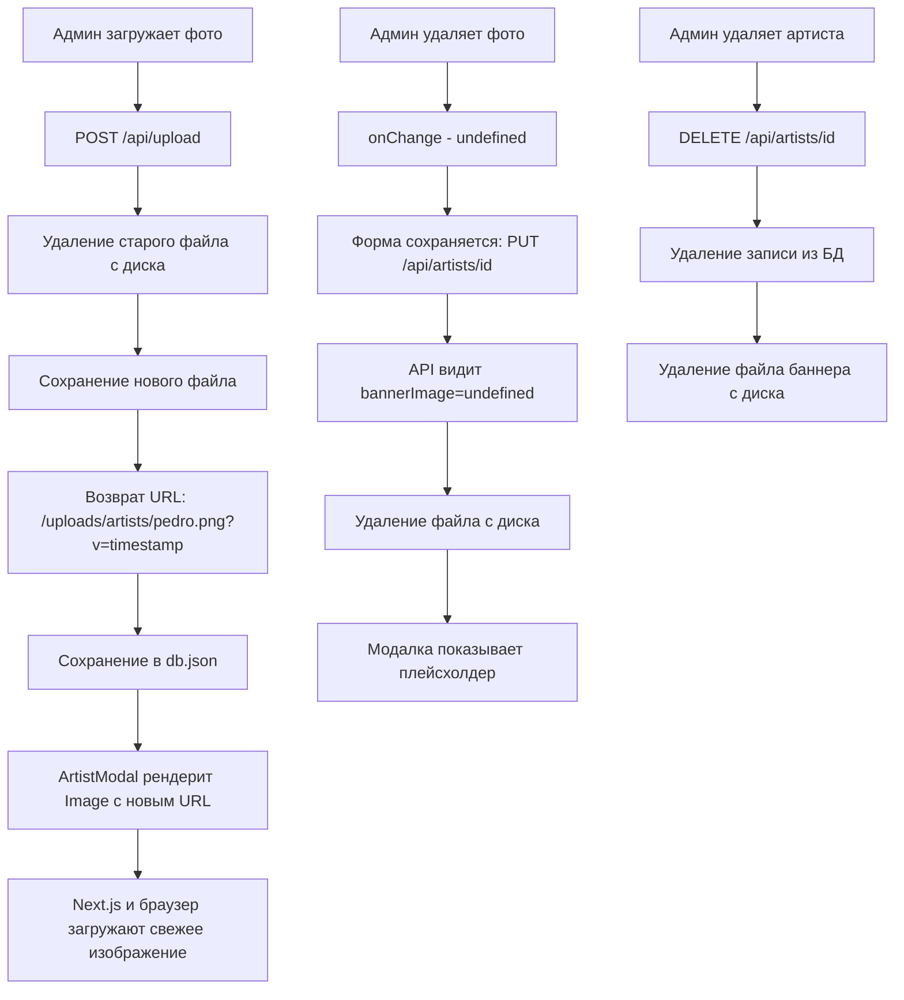

# План исправления: Фото артиста не обновляется в модальном окне

## Описание проблемы

Когда администратор загружает новое фото для артиста или удаляет его, модальное окно на главной странице продолжает показывать **старое** фото. 

## Корневые причины

### 1. Кэширование Next.js Image Optimization (ГЛАВНАЯ ПРОБЛЕМА)

Компонент `ArtistModal` использует `<Image src={artist.bannerImage} />` от Next.js. Когда фото заменяется, **путь файла не меняется** — `/uploads/artists/pedro.png` остаётся тем же. Next.js оптимизирует изображения и кэширует результат по URL. Браузер тоже кэширует по тому же URL. Результат — показывается старое изображение.

### 2. Рассинхронизация состояния в BannerUpload

`BannerUpload` хранит локальный `preview` стейт, инициализируемый один раз из `value`. Если `value` меняется извне, `preview` не обновляется — React не пересоздаёт компонент при изменении пропсов, если ключ не меняется.

### 3. Нет удаления файла при снятии баннера

`handleRemove()` в BannerUpload очищает только стейт формы, но физический файл остаётся на диске как мусор.

### 4. Нет удаления файла при удалении артиста

`DELETE /api/artists/[id]` удаляет только запись из db.json, но файл баннера остаётся в `public/uploads/artists/`.

---

## Решение

### Подход: Cache-busting через `?v=timestamp` в URL

При каждой загрузке файла API возвращает URL с уникальным query-параметром: `/uploads/artists/pedro.png?v=1715387413`. Это заставляет Next.js и браузер воспринимать это как **новый ресурс** и загрузить свежее изображение.

---

## Изменения по файлам

### 1. `app/api/upload/route.ts` — Cache-busting в URL

**Было:** `return NextResponse.json({ url });` где `url = /uploads/artists/pedro.png`
**Станет:** `return NextResponse.json({ url: `${url}?v=${Date.now()}` });`

Это ключевое изменение — каждый раз при загрузке возвращается уникальный URL, который пробивает кэш Next.js и браузера.

### 2. `app/api/artists/[id]/route.ts` — Удаление файлов

**В PUT-обработчике:** если `bannerImage` стал `undefined/null`, а старый артист имел `bannerImage` — удалить файл с диска.

**В DELETE-обработчике:** перед удалением записи из БД — проверить `bannerImage` и удалить файл с диска.

Для удаления файла нужна вспомогательная функция, которая:
- Извлекает путь из URL (убирая `?v=...`)
- Проверяет все возможные расширения (png, jpg, jpeg, webp, gif)
- Удаляет файл если существует

### 3. `components/artist-form/BannerUpload.tsx` — Убрать рассинхронизацию

**Проблема:** `preview` стейт инициализируется один раз и не синхронизируется с `value`.

**Решение:** Убрать `preview` стейт полностью. Использовать `value` напрямую как источник для отображения. `preview` был избыточным — после загрузки `onChange(url)` обновляет родителя, который передаёт новый `value` обратно.

### 4. `data/db.json` — Обновить существующий URL

Добавить `?v=` к текущему `bannerImage` для согласованности:
`"/uploads/artists/pedro.png"` → `"/uploads/artists/pedro.png?v=1715387413"`

---

## Что НЕ нужно менять

- `next.config.ts` — локальные изображения из `public/` уже разрешены
- `ArtistModal.tsx` — он просто рендерит `artist.bannerImage`, проблема не в нём
- `ArtistForm.tsx` — логика формы корректна, проблема в BannerUpload
- `lib/db.ts` — БД-слой не должен знать о файлах

---

## Проверка после исправления

1. **Загрузка нового фото** → старый файл удаляется, новый отображается в модалке
2. **Удаление фото** → файл удаляется с диска, модалка показывает плейсхолдер с инициалами
3. **Удаление артиста** → файл баннера удаляется с диска, нет мусорных файлов
4. **Замена фото** → новый URL с `?v=` пробивает кэш, отображается актуальное фото
