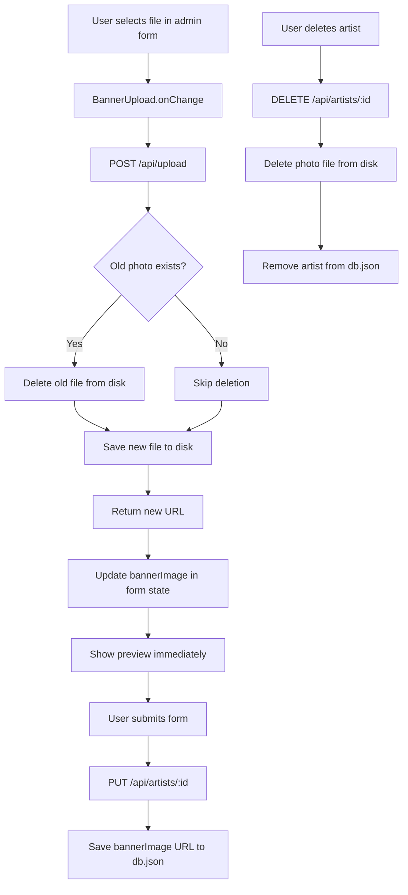

# Artist Photo Management Plan

## Current State Analysis

### Data Model
- [`Artist`](types/content.ts:30) has a `bannerImage?: string` field — this is the **single photo** per artist.
- Currently only **Pedro** has `bannerImage` set in [`db.json`](data/db.json:53). Other artists (Boraa, Farik Interlude, Shayyo, Inmysoul) have no photo.

### Upload API (`/api/upload`)
- [`POST /api/upload`](app/api/upload/route.ts) already **deletes old photos** before saving new ones (lines 44-53): it iterates over all possible extensions and calls `unlink()`.
- Files are saved to `public/uploads/artists/{artistId}.{ext}`.
- This part is **already correct** — old photo cleanup works.

### Admin Form (`ArtistForm.tsx`)
- [`ArtistForm`](components/ArtistForm.tsx) has an inline banner upload section (lines 114-142) with a raw `<input type="file">`.
- The file input **lacks an `onChange` handler** — upload only happens during form submission via [`handleSubmit`](components/ArtistForm.tsx:71).
- A separate [`BannerUpload`](components/artist-form/BannerUpload.tsx) component exists but is **not used** in `ArtistForm`.

### Frontend Display (`ArtistModal.tsx`)
- [`ArtistModal`](components/ArtistModal.tsx:108) displays `artist.bannerImage` in an `<Image>` component.
- Falls back to initials + gradient if no `bannerImage` is set.

### Delete Artist (`/api/artists/[id]`)
- [`DELETE /api/artists/[id]`](app/api/artists/[id]/route.ts:35) removes the artist from `db.json` but does **not** delete the associated photo file from disk.

---

## Proposed Changes

### 1. Refactor `ArtistForm` to use `BannerUpload` component

**Files to modify:**
- [`components/ArtistForm.tsx`](components/ArtistForm.tsx)
- [`components/artist-form/BannerUpload.tsx`](components/artist-form/BannerUpload.tsx)

**Changes:**
- Replace the inline banner upload section in `ArtistForm` with the `<BannerUpload>` component.
- Update `BannerUpload` to accept an `onChange` callback that receives the uploaded URL.
- Add an `onChange` handler on the file input in `BannerUpload` that triggers upload immediately on file selection (not on form submit).
- Remove the duplicate banner upload logic from `ArtistForm`.

### 2. Trigger photo upload on file selection (instant preview)

**Files to modify:**
- [`components/artist-form/BannerUpload.tsx`](components/artist-form/BannerUpload.tsx)

**Changes:**
- Add `onChange` event to the `<input type="file">` that calls `handleUpload` immediately.
- Show a loading state while the upload is in progress.
- Update preview as soon as upload completes.

### 3. Delete photo when artist is deleted

**Files to modify:**
- [`app/api/artists/[id]/route.ts`](app/api/artists/[id]/route.ts)

**Changes:**
- In the `DELETE` handler, before removing the artist from the database, check if the artist has a `bannerImage` and delete the file from disk.
- Use the same extension-iteration pattern as the upload API.

### 4. Update seed data with bannerImage for all artists

**Files to modify:**
- [`data/seed.ts`](data/seed.ts)
- [`data/db.json`](data/db.json)

**Changes:**
- Add `bannerImage: "/uploads/artists/{id}.png"` to all artists in both `seed.ts` and `db.json`.
- Ensure the actual image files exist in `public/uploads/artists/`.

### 5. (Optional) Add "Remove photo" button

**Files to modify:**
- [`components/artist-form/BannerUpload.tsx`](components/artist-form/BannerUpload.tsx)
- [`app/api/upload/route.ts`](app/api/upload/route.ts) — or a new endpoint

**Changes:**
- Add a "Remove" button next to the preview that clears the `bannerImage` field.
- This would require either a new API endpoint or extending the `PUT /api/artists/:id` to handle setting `bannerImage` to `undefined`.

---

## Data Flow Diagram

## Files to Modify (Summary)

| File | Change |
|------|--------|
| [`components/artist-form/BannerUpload.tsx`](components/artist-form/BannerUpload.tsx) | Add `onChange` on file input, loading state, remove button |
| [`components/ArtistForm.tsx`](components/ArtistForm.tsx) | Replace inline banner section with `<BannerUpload>` component |
| [`app/api/artists/[id]/route.ts`](app/api/artists/[id]/route.ts) | Add photo file deletion in DELETE handler |
| [`data/seed.ts`](data/seed.ts) | Add `bannerImage` to all seed artists |
| [`data/db.json`](data/db.json) | Add `bannerImage` to all artists |

## What Already Works (No Changes Needed)

- [`POST /api/upload`](app/api/upload/route.ts) — already deletes old photos before saving new ones.
- [`ArtistModal`](components/ArtistModal.tsx) — already displays `bannerImage` correctly.
- [`PUT /api/artists/:id`](app/api/artists/[id]/route.ts:17) — already saves `bannerImage` to the database.
