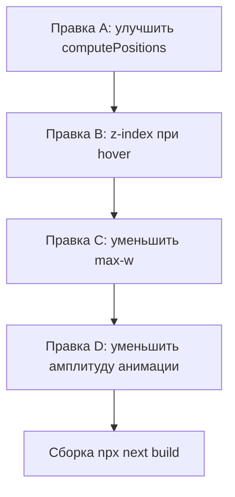

# Artists Positioning Fix — Plan

## Проблема

Имена артистов в секции Artists:
1. **Слишком близко друг к другу** — при 5 артистах на desktop (2 колонки, 3 строки) jitter внутри ячеек недостаточно разводит имена по вертикали, а в одной строке оба имени оказываются на одинаковой высоте
2. **Перекрытие при масштабировании** — `hover:scale-[1.4]` / `lg:hover:scale-[1.8]` увеличивает имя так, что оно залезает на соседей; нет z-index управления
3. **Плавающая анимация усугубляет** — `y: [0, ±10, 0]` с бесконечным повтором периодически сдвигает имена в зону перекрытия

## Корневые причины

| Причина | Где | Почему это проблема |
|---------|-----|---------------------|
| Jitter слишком мал по Y | `computePositions()` строка 52 | ±20% от cellH при 3 строках = ±6.7% — имена в соседних строках могут быть ближе чем нужно |
| Нет вертикального смещения между колонками | `computePositions()` | Оба имени в одной строке (col 0, col 1) получают одинаковый `baseTop` — jitter ±6.7% не разводит их заметно |
| Нет z-index при hover | `motion.button` строка 115 | Hovered имя рендерится в DOM-порядке, не поверх соседей |
| `max-w-[86vw]` слишком широкое | className строка 151 | На мобильных имя занимает почти весь экран, гарантированно перекрывая соседа |
| Плавающая анимация ±10px | `animate.y` строка 125 | При плотной расстановке ±10px = перекрытие |

## Решение — 4 точечные правки

### Правка A: Улучшить алгоритм computePositions()

**Цель**: Гарантировать минимальное расстояние между именами по вертикали + визуально разводить колонки.

Изменения в [`computePositions()`](sections/ArtistsSection.tsx:36):

1. **Увеличить jitter Y** с ±20% до ±25% от cellH — больше разброс по вертикали
2. **Добавить вертикальное смещение между колонками** — чётная колонка (col 1) получает смещение вниз на `cellH * 0.15` — это создаёт диагональный паттерн вместо горизонтального выравнивания
3. **Уменьшить jitter X** с ±30% до ±20% от cellW — имена ближе к краям секции, дальше от центра и друг от друга
4. **Ограничить top** чтобы имена не выходили за границы: `clamp(2, top, 95)`

```pseudo
function computePositions(count, isDesktop):
  cols = isDesktop ? 2 : 1
  rows = ceil(count / cols)
  cellH = 100 / rows
  cellW = 100 / cols

  for each (index):
    row = floor(index / cols)
    col = index % cols

    baseTop = row * cellH + cellH * 0.5
    // Чётная колонка — сдвиг вниз для диагонального паттерна
    if col === 1: baseTop += cellH * 0.15

    baseX = col * cellW + cellW * 0.5

    // Уменьшенный jitter X, увеличенный jitter Y
    jitterX = seededRandom(index * 7 + 3) * 0.4 - 0.2   // ±20%
    jitterY = seededRandom(index * 13 + 5) * 0.5 - 0.25  // ±25%

    top = clamp(2, baseTop + jitterY * cellH, 95)
    x = baseX + jitterX * cellW

    align = x < 50 ? "left" : "right"
    xValue = align === "left" ? x : 100 - x
    rotate = (seededRandom(index * 17 + 11) - 0.5) * 4

    return { top, x: xValue, align, rotate }
```

### Правка B: Z-index при hover

**Цель**: Наведённое имя всегда поверх остальных.

В [`motion.button`](sections/ArtistsSection.tsx:115) — добавить динамический `zIndex` в `style`:

```tsx
style={{
  top: `${pos.top}%`,
  ...(pos.align === "left" ? { left: `${pos.x}%` } : { right: `${pos.x}%` }),
  rotate: `${pos.rotate}deg`,
  zIndex: isHovered ? 20 : 1,
}}
```

### Правка C: Уменьшить max-w на мобильных

**Цель**: Имя не занимает весь экран, оставляя пространство для соседа.

В className [`motion.button`](sections/ArtistsSection.tsx:151):

```
было:  max-w-[86vw]
стало: max-w-[60vw] sm:max-w-[70vw]
```

### Правка D: Уменьшить амплитуду плавающей анимации

**Цель**: Снизить риск перекрытия из-за бесконечной анимации.

В [`animate`](sections/ArtistsSection.tsx:124) — уменьшить `y` амплитуду:

```
было:  y: [0, isDesktop ? (index % 2 ? -10 : 10) : (index % 2 ? -5 : 5), 0]
стало: y: [0, isDesktop ? (index % 2 ? -6 : 6) : (index % 2 ? -3 : 3), 0]
```

## Файлы

- [`sections/ArtistsSection.tsx`](sections/ArtistsSection.tsx) — все 4 правки в одном файле

## Порядок выполнения


