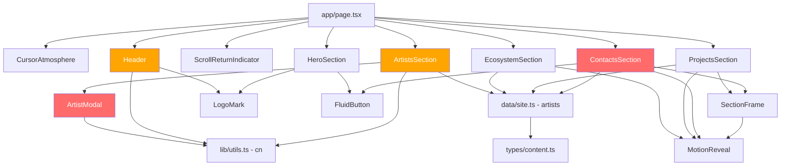

# RAAM Site — Debug & Fix Plan

**Project:** `raam-site` (Next.js 16 + Tailwind CSS 4 + Framer Motion)  
**Date:** 2026-05-09  
**Status:** Build passes, lint passes, but multiple functional and UX issues exist

---

## Executive Summary

The project had an **empty `package.json`** with zero dependencies, making it completely non-installable. After manually installing all required packages, the build and lint pass cleanly. However, 9 additional issues remain — ranging from dead portfolio links to a non-functional contact form.

---

## Issue Registry

### 🔴 CRITICAL

| # | Issue | File | Detail |
|---|-------|------|--------|
| 1 | Empty `package.json` dependencies | `package.json` | **FIXED** — installed `next`, `react`, `react-dom`, `framer-motion`, `lucide-react`, `clsx`, `tailwindcss`, `@tailwindcss/postcss`, `typescript`, `eslint`, `eslint-config-next`, `@types/node`, `@types/react` |

### 🟠 HIGH

| # | Issue | File | Detail |
|---|-------|------|--------|
| 2 | All portfolio links are dead | `data/site.ts`, `ArtistModal.tsx:156` | `ArtistMedia` entries have no `url` field. The fallback `item.url ?? "#contacts"` means all 10 portfolio links across 5 artists just scroll to contacts instead of opening content |
| 3 | Contact form never sends data | `ContactsSection.tsx:35-48` | `onSubmit` validates and sets status to `"ready"` but never actually sends the form data anywhere — no API route, no email service, no `mailto:` fallback |

### 🟡 MEDIUM

| # | Issue | File | Detail |
|---|-------|------|--------|
| 4 | `<select>` dropdown unreadable | `ContactsSection.tsx:104-113` | Dark-styled `<select>` with light text renders fine in the closed state, but the OS-native dropdown menu has a white background — making light text invisible |
| 5 | Scroll lock conflict | `ArtistModal.tsx:42`, `Header.tsx:30` | Both components independently set `document.body.style.overflow = "hidden"`. If the mobile nav is open and an artist modal opens, closing one restores scroll prematurely while the other is still active |
| 6 | Hardcoded 5-position layout | `ArtistsSection.tsx:11-17` | `namePositions` is a fixed 5-element array. Adding or removing an artist from `data/site.ts` will either leave positions unassigned or cause an index-out-of-bounds visual bug |
| 7 | PostCSS XSS vulnerability | `node_modules/postcss` | 2 moderate severity vulnerabilities from PostCSS < 8.5.10. Cannot `npm audit fix` without breaking Next.js — must wait for upstream patch |

### 🔵 LOW

| # | Issue | File | Detail |
|---|-------|------|--------|
| 8 | Unused default Next.js assets | `public/file.svg`, `public/globe.svg`, `public/next.svg`, `public/vercel.svg`, `public/window.svg` | Template boilerplate not referenced anywhere in the codebase |
| 9 | Empty `styles/` directory | `styles/` | Directory exists but contains no files — all styles are in `app/globals.css` and Tailwind |
| 10 | Default favicon not branded | `app/favicon.ico` | Still the Next.js default favicon instead of a RAAM-branded icon |

---

## Fix Plan

### Phase 1: High Priority — Functional Breakages

#### Fix 2: Dead Portfolio Links

**Option A — Coming Soon State (Recommended for MVP):**
- In `ArtistModal.tsx`, when `item.url` is falsy, render the portfolio item as a disabled/non-interactive element with a subtle "Coming soon" badge
- This avoids broken navigation and sets clear user expectations

**Option B — Add Real URLs:**
- Add `url` values to each `ArtistMedia` entry in `data/site.ts`
- Requires actual YouTube/SoundCloud links for each portfolio item

**Code changes:**
- `components/ArtistModal.tsx` — conditionally render `<a>` vs `
` based on `item.url`
- `data/site.ts` — optionally add URLs if available

#### Fix 3: Contact Form Dead End

**Option A — mailto: Fallback (Quick):**
- On valid submit, construct a `mailto:` link with the form data pre-filled
- Open via `window.location.href = mailtoLink`
- Simple, no backend needed, but less professional

**Option B — Next.js API Route + Email Service (Proper):**
- Create `app/api/contact/route.ts` as a Server Action or API route
- Integrate an email service (Resend, SendGrid, or Nodemailer)
- Add loading state and proper error handling to the form
- Requires email service API key

**Option C — Third-Party Form Service:**
- Use Formspree, Getform, or similar
- Replace `onSubmit` with `action` pointing to the external endpoint
- Minimal code changes, but adds external dependency

**Code changes:**
- `sections/ContactsSection.tsx` — update `onSubmit` handler
- New file: `app/api/contact/route.ts` (if Option B)

---

### Phase 2: Medium Priority — UX & Robustness

#### Fix 4: Select Dropdown Readability

- Add `appearance-none` class to the `<select>` element
- Add a custom chevron icon via CSS or inline SVG
- Style the `<option>` elements with explicit `bg-[#0b0a09] text-stone-100` for browsers that support it
- Alternatively, replace `<select>` with a custom radio button group for full styling control

**Code changes:**
- `sections/ContactsSection.tsx` — update `<select>` styling

#### Fix 5: Scroll Lock Conflict

- Create a shared `useScrollLock(active: boolean)` hook in `lib/utils.ts`
- Use a reference counter pattern: increment on lock, decrement on unlock, only restore `overflow: ""` when counter reaches 0
- Replace direct `document.body.style.overflow` manipulation in both `ArtistModal.tsx` and `Header.tsx`

**Code changes:**
- `lib/utils.ts` — add `useScrollLock` hook
- `components/ArtistModal.tsx` — replace `useEffect` scroll lock with `useScrollLock(!!artist)`
- `components/Header.tsx` — replace `useEffect` scroll lock with `useScrollLock(open)`

#### Fix 6: Dynamic Artist Positions

- Replace the hardcoded `namePositions` array with a computed function
- Derive positions from `artists.length` using a distribution algorithm
- Example: distribute evenly across a grid, or use a spiral/circular layout

**Code changes:**
- `sections/ArtistsSection.tsx` — replace `namePositions` with a computed layout function

#### Fix 7: PostCSS Vulnerability

- Monitor for Next.js update that ships PostCSS >= 8.5.10
- Run `npm audit fix` once available
- No action needed now — this is an upstream issue

---

### Phase 3: Low Priority — Cleanup

#### Fix 8: Remove Unused Assets

- Delete `public/file.svg`, `public/globe.svg`, `public/next.svg`, `public/vercel.svg`, `public/window.svg`
- These are Next.js template defaults not referenced in any component

#### Fix 9: Remove Empty `styles/` Directory

- Delete the empty `styles/` directory
- All styling is handled via `app/globals.css` and Tailwind utility classes

#### Fix 10: Branded Favicon

- Create a RAAM-branded favicon (the "RA" initials from `LogoMark` would work well)
- Replace `app/favicon.ico`
- Optionally add `icon.svg` and `apple-icon.png` for modern browsers

---

## Architecture Diagram

**Red** = components with functional bugs (dead links, non-functional form)  
**Orange** = components with scroll lock conflict or hardcoded layout

---

## Recommended Execution Order

1. Fix portfolio links — coming soon state or real URLs
2. Fix contact form — at minimum a `mailto:` fallback
3. Fix select dropdown readability
4. Create shared `useScrollLock` hook
5. Make artist positions dynamic
6. Clean up unused assets and empty directories
7. Add branded favicon
8. Update PostCSS when upstream patch is available
