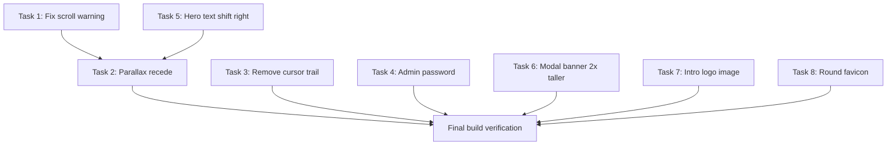

# Fixes & Enhancements Plan

## Task Overview

| # | Task | Files | Complexity |
|---|------|-------|------------|
| 1 | Fix framer-motion scroll container warning | `app/layout.tsx`, `app/globals.css` | Low |
| 2 | Parallax recede effect on hero scroll | `sections/HeroSection.tsx` | Medium |
| 3 | Remove cursor trail animation | `components/PageShell.tsx`, `components/CursorTrail.tsx` | Low |
| 4 | Change admin password to raamlabelaz | `.env.local` | Low |
| 5 | Shift hero text/buttons right | `sections/HeroSection.tsx` | Low |
| 6 | Artist modal banner 2x taller | `components/ArtistModal.tsx` | Low |
| 7 | Logo image on intro loading screen | `components/PageIntro.tsx` | Low |
| 8 | Round logo favicon in browser tab | `app/icon.tsx` (new) | Medium |

---

## Task 1: Fix framer-motion scroll container position warning

**Problem:** Console warning: *"Please ensure that the container has a non-static position, like relative, fixed, or absolute to ensure scroll offset is calculated correctly."*

**Root cause:** [`ScrollBackground.tsx`](components/ScrollBackground.tsx:11) calls `useScroll()` without a `target`, which makes framer-motion measure against the viewport. The `<html>` element lacks explicit positioning, causing the offset calculation warning.

**Fix:**
- Add `relative` to the `<html>` element in [`app/layout.tsx`](app/layout.tsx:24) — currently `className="h-full antialiased"`, change to `className="relative h-full antialiased"`

---

## Task 2: Parallax recede effect on hero scroll

**Goal:** As the user scrolls down, the hero content should appear to recede/optically move away — like it's sinking into depth.

**Current state:** [`HeroSection.tsx`](sections/HeroSection.tsx:17) already has parallax — image at 30% scroll speed, text at 8% scroll speed, plus a darkening overlay.

**Implementation:**
- Add a `scale` transform on the hero content that goes from `1` → `0.92` as scroll progresses, creating a zoom-out/recede illusion
- Add a slight `opacity` decrease from `1` → `0.6` to enhance the depth feeling
- Apply these transforms to the `<motion.div>` wrapping the hero copy at [line 45](sections/HeroSection.tsx:45)

```tsx
const contentScale = useTransform(scrollYProgress, [0, 1], [1, 0.92]);
const contentOpacity = useTransform(scrollYProgress, [0, 0.8], [1, 0.6]);

// Then on the motion.div:
style={{ y: textY, scale: contentScale, opacity: contentOpacity }}
```

---

## Task 3: Remove cursor trail animation

**Goal:** Remove the canvas-based cursor trail that follows mouse movement.

**Implementation:**
1. Remove `<CursorTrail />` from [`components/PageShell.tsx`](components/PageShell.tsx:29)
2. Delete [`components/CursorTrail.tsx`](components/CursorTrail.tsx) entirely
3. Remove the `CursorTrail` import in [`PageShell.tsx`](components/PageShell.tsx:5)

> Note: `CursorAtmosphere` stays — it only updates CSS custom properties for the radial gradient spotlight, no visible trail.

---

## Task 4: Change admin password to raamlabelaz

**Current:** [`lib/auth.ts`](lib/auth.ts:24) reads `process.env.ADMIN_PASSWORD`

**Implementation:**
- Create/update `.env.local` with `ADMIN_PASSWORD=raamlabelaz`
- Update [`.env.example`](.env.example) comment to show the expected format

---

## Task 5: Shift hero text and buttons one step to the right

**Current:** [`HeroSection.tsx`](sections/HeroSection.tsx:46) — hero copy container uses `mx-auto flex w-full max-w-[56rem] flex-col items-center px-5 text-center`

**Implementation:**
- Change the container alignment from fully centered to slightly right-offset
- Replace `items-center` with `items-center` kept but shift the whole block right
- Add `ml-[8%]` or change to a two-column layout where text occupies the right portion
- Simplest approach: keep `items-center text-center` but change `mx-auto` to `ml-auto mr-[5%]` and reduce `max-w` slightly, creating a right-biased layout

```tsx
// Before:
className="hero-copy relative z-10 mx-auto flex w-full max-w-[56rem] flex-col items-center px-5 text-center"

// After:
className="hero-copy relative z-10 ml-[8%] mr-auto flex w-full max-w-[48rem] flex-col items-center px-5 text-center"
```

---

## Task 6: Artist modal banner photos 2x taller

**Current:** [`ArtistModal.tsx`](components/ArtistModal.tsx:107) — banner container uses `aspect-[4/3]`

**Implementation:**
- Change `aspect-[4/3]` to `aspect-[4/6]` which is equivalent to `aspect-[2/3]`
- This doubles the height while keeping the same width

```tsx
// Before:
className="relative mt-8 aspect-[4/3] overflow-hidden ..."

// After:
className="relative mt-8 aspect-[2/3] overflow-hidden ..."
```

---

## Task 7: Logo image on intro loading screen

**Current:** [`PageIntro.tsx`](components/PageIntro.tsx:52) shows "RAAM" text with `motion.span`

**Implementation:**
- Replace the text `<motion.span>RAAM</motion.span>` with an `<Image>` of the logo
- Use the same logo as the hero: `/assets/images/logo.png`
- Keep the same animation sequence: scale in → line expand → overlay fade out

```tsx
import Image from "next/image";

// Replace the motion.span with:
<motion.div
  initial={{ opacity: 0, scale: 0.85 }}
  animate={{ opacity: 1, scale: 1 }}
  exit={{ opacity: 0, scale: 1.08 }}
  transition={{
    opacity: { duration: 0.6, ease: [0.22, 1, 0.36, 1] },
    scale: { duration: 1.2, ease: [0.22, 1, 0.36, 1] },
  }}
>
  <Image
    src="/assets/images/logo.png"
    alt="RAAM"
    width={400}
    height={170}
    className="h-32 w-auto sm:h-44"
    priority
  />
</motion.div>
```

---

## Task 8: Round logo favicon in browser tab

**Current:** [`app/favicon.ico`](app/favicon.ico) — default Next.js favicon, not round

**Implementation using Next.js `app/icon.tsx`:**
- Create [`app/icon.tsx`](app/icon.tsx) using Next.js `ImageResponse` API to generate a circular favicon programmatically
- Render a dark circle background with the RAAM text centered
- This generates `/icon` route at build time — Next.js uses it as the favicon automatically
- Also create [`app/apple-icon.tsx`](app/apple-icon.tsx) for Apple devices

```tsx
// app/icon.tsx
import { ImageResponse } from "next/og";

export const size = { width: 32, height: 32 };
export const contentType = "image/png";

export default function Icon() {
  return new ImageResponse(
    (
      <div
        style={{
          width: "100%",
          height: "100%",
          display: "flex",
          alignItems: "center",
          justifyContent: "center",
          borderRadius: "50%",
          backgroundColor: "#080706",
          border: "1px solid rgba(255,255,255,0.1)",
        }}
      >
        <span
          style={{
            fontSize: 14,
            fontWeight: 700,
            color: "#f5f0e8",
            letterSpacing: "0.08em",
          }}
        >
          R
        </span>
      </div>
    ),
    { ...size }
  );
}
```

> **Alternative:** If the user has a round logo image file, we can simply place it as `app/icon.png` instead. The programmatic approach works without needing an external image.

---

## Execution Order



Tasks 1 and 5 should be done before Task 2 since they all modify HeroSection. The rest are independent and can be done in any order. Final build verification after all tasks.
