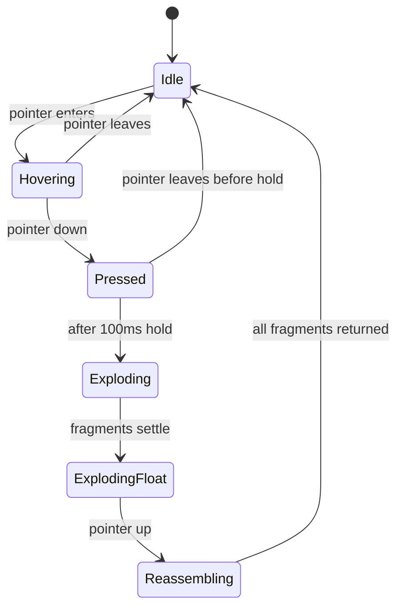

# Logo Animation Upgrade v2 — Bug Fixes & Enhancements

## Bugs Found in Current Implementation

### Bug 1: Stale Closure in `triggerExplosion`
**File**: [`components/Logo3D.tsx`](components/Logo3D.tsx:261)
**Problem**: `triggerExplosion` captures `currentFragments` from the render closure at the time `setTimeout` was scheduled. If fragments state changes between `handlePointerDown` and the timeout firing, the explosion uses stale data.
**Fix**: Use a ref to track the latest fragments, or compute scatter inline in `handlePointerDown` before scheduling the explosion.

### Bug 2: Shockwave Rings Crash on Reassemble
**File**: [`components/Logo3D.tsx`](components/Logo3D.tsx:490)
**Problem**: `ref.current!.getBoundingClientRect()` is called during animation of shockwave rings. When `handlePointerUp` triggers `reassembling` state, the `AnimatePresence` exit animation may try to read `ref.current` which could be null if the component unmounts or ref detaches.
**Fix**: Store container dimensions in state/ref at click time instead of reading during animation.

### Bug 3: Unused Imports and State
**File**: [`components/Logo3D.tsx`](components/Logo3D.tsx:3)
**Problem**: `useEffect` is imported but never used. `holdTime` state is set but never read. `animationFrameRef` is declared but never used for actual animation frames.
**Fix**: Remove unused imports and state variables.

### Bug 4: `isMobile` Doesn't React to Window Resize
**File**: [`components/Logo3D.tsx`](components/Logo3D.tsx:151)
**Problem**: `isMobile` is computed once at render time using `typeof window !== "undefined" && window.innerWidth < 640`. It never updates when the window is resized, so rotating a tablet from landscape to portrait won't switch grid sizes.
**Fix**: Use a `useMediaQuery` hook or `useEffect` with `resize` listener.

### Bug 5: Floating/Rotation Animation Uses Wrong Coordinate Space
**File**: [`components/Logo3D.tsx`](components/Logo3D.tsx:431-457)
**Problem**: The inner `motion.div` with floating and rotation animates the image inside the clipped fragment. However, the `clipPath` is on the **parent** `motion.div`, and the inner div rotates the image — but the clip path doesn't move with the rotation, causing the image to rotate out of its clip boundary and reveal empty space or adjacent fragments.
**Fix**: Apply floating and rotation directly on the fragment `motion.div` (the one with `clipPath`), not on a child div. Use `transformOrigin` per fragment to rotate around its own center.

### Bug 6: `handleReassembleComplete` Fires Only on `fragment.id === 0`
**File**: [`components/Logo3D.tsx`](components/Logo3D.tsx:425)
**Problem**: The `onComplete` callback only fires when fragment with `id === 0` finishes its reassemble animation. If the grid changes (e.g., mobile resize), fragment 0 may not exist or may not be the last to finish.
**Fix**: Use a `onAnimationComplete` on the parent container or track all fragments completing via a counter.

### Bug 7: Particles Don't Use `rotation` Property
**File**: [`components/Logo3D.tsx`](components/Logo3D.tsx:544)
**Problem**: The `initial` state sets `rotate: 0`, and `animate` sets `rotate: particle.rotationSpeed`. The `particle.rotation` property (initial rotation) is never used. Also `rotationSpeed` is used as the final rotation value instead of being accumulated over time.
**Fix**: Use `initial: { rotate: particle.rotation }` and animate to `rotate: particle.rotation + particle.rotationSpeed * 1.2`.

### Bug 8: No Cleanup on Unmount
**File**: [`components/Logo3D.tsx`](components/Logo3D.tsx:145, 302)
**Problem**: `setTimeout` in `triggerExplosion` (line 302) and `holdTimerRef` are not cleaned up on component unmount. If the component unmounts while a timeout is pending, it will try to set state on an unmounted component.
**Fix**: Add a `useEffect` cleanup that clears all timers.

---

## Enhancements

### Enhancement 1: Cursor-Follow Parallax on Exploded Fragments
**Description**: While fragments are exploded, moving the cursor should cause fragments to subtly drift toward/away from the cursor, creating a magnetic interaction.
**Implementation**:
- Track cursor position relative to container center
- Apply a subtle additional transform offset to each fragment based on its distance from cursor
- Use `requestAnimationFrame` for smooth updates
- Offset magnitude: ~10-20px max, inversely proportional to distance

### Enhancement 2: Gravity Pull-Back on Reassemble
**Description**: When releasing, fragments should overshoot their target position slightly and then settle, like they're being pulled back by gravity.
**Implementation**:
- Use a spring with low stiffness and high damping for the initial approach
- Add a small bounce via `stiffness: 400, damping: 18` (creates 1-2 overshoot cycles)
- Each fragment gets a slightly different stiffness based on distance from center

### Enhancement 3: Sparkle Trail Particles
**Description**: In addition to the burst particles, add tiny sparkle particles that trail behind flying fragments during explosion.
**Implementation**:
- Spawn 10-15 tiny sparkle particles at each fragment position during explosion
- Sparkles are 1-2px, white/gold, with fast fade-out (300ms)
- Use a separate particle array with shorter lifetime

### Enhancement 4: Haptic-Like Scale Pulse
**Description**: On press, add a subtle scale pulse (1 → 0.98 → 1.02 → 1) to simulate tactile feedback.
**Implementation**:
- Animate the entire logo container scale on `pointerdown`
- Duration: 200ms, ease: easeInOut
- Creates a "squish" effect before explosion

### Enhancement 5: Ambient Glow Pulse
**Description**: The glow layer should have a very subtle breathing pulse even in idle state.
**Implementation**:
- Add a CSS `@keyframes logo-glow-pulse` that oscillates opacity between 0.10 and 0.16
- Apply to glow layer with 4s duration, easeInOut, infinite
- Only in idle state, disabled during interaction

### Enhancement 6: Staggered Reassemble
**Description**: When reassembling, outer fragments should return first, inner fragments last, creating a satisfying "snap-to-center" wave.
**Implementation**:
- Calculate distance of each fragment from container center
- Sort fragments by distance (farthest first)
- Apply delay proportional to distance: `delay = distance_from_center * 0.008`
- Creates a radial snap effect

### Enhancement 7: Fragment Shadow/Depth on Explosion
**Description**: Each fragment should cast a subtle drop shadow when exploded to enhance the 3D depth effect.
**Implementation**:
- Add `filter: drop-shadow(0 4px 8px rgba(0,0,0,0.5))` to fragments during explosion
- Remove shadow on reassemble
- Use CSS transition or framer-motion for smooth shadow changes

---

## Updated State Machine

## Performance Considerations

| Concern | Solution |
|---------|----------|
| 72 fragments × 2 images | Already using `contain: strict` and `will-change: transform` |
| Cursor parallax on 72 elements | Use CSS custom properties + transform, not React state per fragment |
| Sparkle particles | Cap at 15, remove after 300ms |
| Staggered reassemble delays | Pre-compute delays, don't recalculate per frame |
| Resize listener | Debounce at 200ms |

## File Changes

### [`components/Logo3D.tsx`](components/Logo3D.tsx)
- Fix all 8 bugs listed above
- Add cursor-follow parallax on exploded fragments
- Add gravity pull-back on reassemble
- Add sparkle trail particles
- Add haptic scale pulse on press
- Add staggered reassemble
- Add fragment shadows on explosion

### [`app/globals.css`](app/globals.css)
- Add `@keyframes logo-glow-pulse` for ambient glow breathing
- Add `.logo-fragment-shadow` utility for explosion depth
