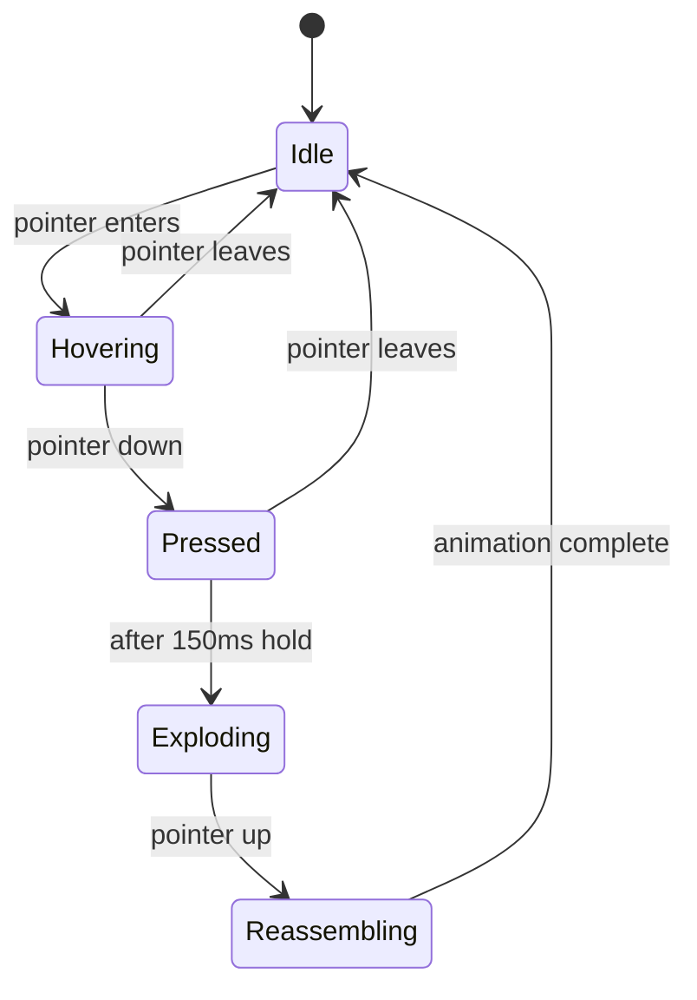

# Logo Animation Upgrade — Luxury Tier

## Goal
Upgrade the hero logo animation from the current 5-strip scatter to a Resend.com-quality luxury interaction with fragments, glow, shockwave, particles, and ambient motion.

## Current State
- **File**: `components/Logo3D.tsx`
- **Mechanism**: 5 horizontal strips via `clipPath: inset()`, spring-based scatter on press, 3D tilt on hover
- **Limitations**: Too few fragments, no Z-depth, no glow, no shockwave, no particles, no idle animation

---

## Architecture

### Fragment Grid System
Replace the 5-strip `clipPath` with an **8×4 grid = 32 fragments**. Each fragment is a `motion.div` with its own `clipPath` computed from grid position.

```
┌───┬───┬───┬───┬───┬───┬───┬───┐
│ 0 │ 1 │ 2 │ 3 │ 4 │ 5 │ 6 │ 7 │  row 0
├───┼───┼───┼───┼───┼───┼───┼───┤
│ 8 │ 9 │10 │11 │12 │13 │14 │15 │  row 1
├───┼───┼───┼───┼───┼───┼───┼───┤
│16 │17 │18 │19 │20 │21 │22 │23 │  row 2
├───┼───┼───┼───┼───┼───┼───┼───┤
│24 │25 │26 │27 │28 │29 │30 │31 │  row 3
└───┴───┴───┴───┴───┴───┴───┴───┘
```

Each fragment stores:
- `clipPath` — computed from col/row position as `inset(top right bottom left)`
- `scatter` — pre-computed explosion vector with x, y, z, rotateX, rotateY, rotateZ, scale, opacity
- `delay` — stagger based on distance from click point, creates wave effect
- `idlePhase` — random phase offset for ambient floating

### Scatter Vector Generation
On click, compute scatter vectors dynamically based on click position:

```
For each fragment:
  1. Calculate fragment center relative to click point
  2. Direction = normalize(fragmentCenter - clickPoint)
  3. Distance factor = random(0.6, 1.4)
  4. scatter.x = direction.x * random(120, 280) * distanceFactor
  5. scatter.y = direction.y * random(120, 280) * distanceFactor
  6. scatter.z = random(80, 250)  // depth explosion
  7. scatter.rotateX = random(-45, 45)
  8. scatter.rotateY = random(-45, 45)
  9. scatter.rotateZ = random(-30, 30)
  10. scatter.scale = random(0.3, 0.7)
  11. scatter.opacity = random(0.15, 0.5)
  12. delay = distance_from_click * 0.02  // wave stagger
```

This makes the explosion radiate FROM the click point — a key luxury detail.

### Animation State Machine



### Layer Stack - bottom to top

```
┌─────────────────────────────────┐
│ 1. Glow Layer                   │  Blurred logo copy, opacity animates
├─────────────────────────────────┤
│ 2. Fragment Grid                │  32 clipped logo pieces
├─────────────────────────────────┤
│ 3. Shockwave Ring               │  Expanding circle on click
├─────────────────────────────────┤
│ 4. Particle Canvas              │  Tiny glowing dots that shed off
└─────────────────────────────────┘
```

### Effect Details

#### 1. Glow/Bloom Layer
- A copy of the logo image with `filter: blur(24px)` and `mix-blend-screen`
- Idle opacity: `0.12`
- Hover opacity: `0.25`
- Pressed/exploding opacity: `0.55`
- Color shifts from white to warm amber `rgba(214, 180, 120, 0.4)` during explosion
- Uses `motion.div` with animated opacity and filter

#### 2. Fragment Grid
- Each fragment: `motion.div` with `clipPath`, absolute positioned over the logo
- Idle: subtle floating via `animate` with `y: [0, -2, 0]` and unique `transition.delay` per fragment
- Hover: 3D tilt preserved from current implementation
- Pressed: fragments scatter with staggered spring
- Reassemble: stiffer spring with overshoot for satisfying snap-back

#### 3. Shockwave Ring
- A `motion.div` with `border-radius: 50%`, `border: 1px solid rgba(255,255,255,0.3)`
- On click: scales from `0` to `2.5`, opacity from `0.6` to `0`
- Duration: ~600ms, ease: `easeOut`
- Positioned at click coordinates
- Second ring with 100ms delay for double-ring effect

#### 4. Particle System
- On click, spawn 24-36 small particles at the click point
- Each particle: tiny `motion.div` with `width/height: 3-6px`, `border-radius: 50%`
- Background: `radial-gradient(circle, rgba(255,220,160,0.9), transparent)`
- Each has random velocity vector, gravity-like arc, and fade-out
- Removed from DOM after 800ms
- Use `AnimatePresence` for clean exit

#### 5. Ambient Idle Animation
- Each fragment has a subtle vertical oscillation: `y: [-1.5, 1.5]`
- Period: 4-7 seconds per fragment, with random offset
- Very subtle — barely perceptible but creates life
- Disabled when `prefers-reduced-motion`

#### 6. Color Temperature Shift
- The glow layer transitions from neutral white to warm amber during explosion
- CSS custom property `--logo-glow-color` animated via framer-motion
- Creates a heat-map feel: cold at rest, hot during interaction

---

## Performance Strategy

| Concern | Solution |
|---------|----------|
| 32 fragments × 2 images each | Use `will-change: transform` and `contain: strict` |
| Particle DOM nodes | Cap at 36, remove after animation |
| Spring calculations | Pre-compute scatter vectors on click, not per frame |
| Canvas alternative | Particles could use a small canvas overlay if DOM perf is insufficient |
| Reduced motion | Fall back to simple opacity fade, no transforms |
| Mobile | Fewer fragments on mobile (6×3 = 18), touch-friendly |

---

## File Changes

### `components/Logo3D.tsx` — Full rewrite
- New fragment grid system with 8×4 grid
- Dynamic scatter computation based on click position
- Glow layer, shockwave, particles all inline
- Idle ambient animation
- State machine: idle → hover → pressed → exploding → reassembling

### `app/globals.css` — Minor additions
- Add `@keyframes logo-idle-float` for ambient animation
- Add `.logo-fragment` utility with `contain: strict; will-change: transform`

### `sections/HeroSection.tsx` — No changes needed
- Already renders `<Logo3D />` correctly

---

## Mobile Considerations
- On screens < 640px: reduce grid to 6×3 = 18 fragments
- Touch: use `onTouchStart`/`onTouchEnd` alongside pointer events
- Shockwave: slightly smaller radius on mobile
- Particles: reduce count to 18 on mobile
