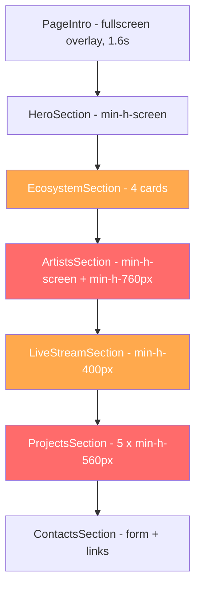

# Mobile Optimization Plan — RAAM Land

## Problem Statement

On mobile devices the site produces an excessively long scroll. The main causes are:

1. **ArtistsSection** uses `min-h-screen` + `min-h-[760px]` with absolutely-positioned, percentage-scattered artist names — creating a huge empty container on small screens.
2. **ProjectsSection** stacks 5 cards each with `min-h-[560px]` vertically — that is ~2800 px of project content alone.
3. **SectionFrame** applies `pb-24` (96 px) bottom padding to every section — 4 sections × 96 px = 384 px of pure whitespace.
4. **EcosystemSection** stacks 4 TiltCards in a single column with generous spacing.
5. **LiveStreamSection** uses `min-h-[400px]` for the countdown state — unnecessary vertical claim on mobile.

---

## Page Section Flow



🔴 = critical scroll offender  
🟠 = moderate scroll offender

---

## Optimization Changes by Section

### 1. HeroSection — Minor tweaks

**File:** `sections/HeroSection.tsx`

| What | Current | Proposed |
|------|---------|----------|
| Section height | `min-h-screen` | Keep `min-h-screen` but add `sm:min-h-screen max-h-[85vh]` on mobile to prevent very tall screens from over-stretching |
| Parallax scale | `[1, 0.72]` | On mobile reduce to `[1, 0.85]` — less dramatic shrink keeps content readable |
| Parallax blur | `[0, 6px]` | On mobile reduce to `[0, 3px]` — less blur keeps CTA visible |
| Button gap | `gap-3` | Keep, already compact |
| Description text | `text-sm ... sm:text-lg` | Keep, already responsive |

**Implementation approach:** Use a `useMediaQuery` or `useScreen` hook to conditionally adjust framer-motion transform ranges. Alternatively, use CSS `@media` to override and let the JS detect mobile via `window.innerWidth < 640`.

---

### 2. EcosystemSection — Compact cards on mobile

**File:** `sections/EcosystemSection.tsx`

| What | Current | Proposed |
|------|---------|----------|
| Section padding | `pt-10 pb-20` | `pt-6 pb-10 sm:pt-10 sm:pb-20` |
| Card grid | `grid gap-3 sm:grid-cols-2` | `grid grid-cols-2 gap-2 sm:gap-3` — force 2-col even on mobile |
| Card padding | `p-5` | `p-3 sm:p-5` |
| Icon container | `h-11 w-11 mb-8` | `h-9 w-9 mb-4 sm:h-11 sm:w-11 sm:mb-8` |
| Card title | `text-xl` | `text-base sm:text-xl` |
| Card description | `text-sm leading-6` | `text-xs leading-5 sm:text-sm sm:leading-6` |
| Heading | `text-4xl ... sm:text-6xl` | `text-3xl sm:text-6xl` |
| Tagline margin | `mt-7` | `mt-4 sm:mt-7` |

**Result:** 4 cards in 2×2 grid instead of 4×1 stack. Cuts this section height roughly in half on mobile.

---

### 3. ArtistsSection — CRITICAL: Redesign layout for mobile

**File:** `sections/ArtistsSection.tsx`

This is the biggest offender. Currently:
- `min-h-screen` + `min-h-[760px]` = at least 760 px of mostly empty space
- Artists are absolutely positioned with `top: 14% + index/length * 68%` — scattered across a tall container
- Floating animation adds visual noise on touch devices
- Hover effects don't translate to mobile

**Proposed mobile layout:**

| What | Current | Proposed for mobile |
|------|---------|---------------------|
| Container | `min-h-screen min-h-[760px]` | `min-h-0` — auto height based on content |
| Layout | Absolute positioning with percentage top | Flex/grid list layout |
| Artist items | `absolute max-w-[86vw] text-2xl` | `relative text-xl` in a compact list |
| Floating animation | Always running | Disable on mobile via `prefers-reduced-motion` or conditional |
| Hover scale | `hover:scale-[1.4]` | Remove on mobile, use active state instead |
| Subtitle on hover | `opacity-0 group-hover:opacity-100` | Always visible on mobile as secondary text |

**Implementation approach:**

Add a mobile-specific render path inside `ArtistsSection`:

```
// Pseudocode
const isMobile = useMediaQuery('(max-width: 639px)');

// Mobile: compact list
if (isMobile) {
  return (
    <section className="... auto-height ...">
      <div className="grid grid-cols-2 gap-3">
        {artists.map(artist => (
          <button className="p-4 rounded-xl border ...">
            <span className="text-lg font-semibold">{artist.name}</span>
            <span className="text-xs text-stone-400">{artist.origin} / {artist.genres[0]}</span>
          </button>
        ))}
      </div>
    </section>
  );
}

// Desktop: existing absolute-positioned layout
return (...);
```

**Result:** Artists section goes from ~760 px minimum to ~300-400 px depending on artist count. Saves ~400 px of scroll.

---

### 4. LiveStreamSection — Reduce minimum heights

**File:** `sections/LiveStreamSection.tsx`

| What | Current | Proposed |
|------|---------|----------|
| Countdown container | `min-h-[400px]` | `min-h-[260px] sm:min-h-[400px]` |
| Empty state container | `min-h-[300px]` | `min-h-[180px] sm:min-h-[300px]` |
| Countdown padding | `px-6 py-16` | `px-4 py-8 sm:px-6 sm:py-16` |
| Countdown title | `text-3xl sm:text-4xl` | Keep |

**Result:** Saves ~140 px on the countdown state.

---

### 5. ProjectsSection — CRITICAL: Horizontal scroll on mobile

**File:** `sections/ProjectsSection.tsx`

Currently 5 cards × `min-h-[560px]` stacked = ~2800 px. This is the second biggest offender.

**Proposed mobile layout:**

| What | Current | Proposed for mobile |
|------|---------|---------------------|
| Grid | `grid ... md:grid-cols-2 lg:grid-cols-3 xl:grid-cols-5` | On mobile: horizontal scrollable carousel with snap |
| Card height | `min-h-[560px]` | `min-h-[420px] sm:min-h-[560px]` |
| Card width | Auto from grid | `min-w-[85vw] snap-center` on mobile |
| Card padding | `p-6` | `p-4 sm:p-6` |
| Title | `text-4xl` | `text-2xl sm:text-4xl` |
| Description margin | `mt-8` | `mt-4 sm:mt-8` |
| Tags margin | `mt-12` | `mt-6 sm:mt-12` |

**Implementation approach:**

```
// Mobile: horizontal scroll carousel
<div className="flex gap-4 overflow-x-auto snap-x snap-mandatory pb-4 md:hidden">
  {projects.map(project => (
    <div className="min-w-[85vw] snap-center min-h-[420px] ...">
      ...
    </div>
  ))}
</div>

// Desktop: existing grid
<div className="hidden md:grid ...">
  ...
</div>
```

**Result:** Projects section goes from ~2800 px to ~420 px visible height on mobile. User swipes horizontally instead of scrolling vertically. Saves ~2400 px of vertical scroll.

---

### 6. ContactsSection — Compact form on mobile

**File:** `sections/ContactsSection.tsx`

| What | Current | Proposed |
|------|---------|----------|
| SectionFrame pb | `pb-12` | Keep, already reasonable |
| Form grid | `grid gap-4 sm:grid-cols-2` | Keep |
| Input height | `h-14` | `h-12 sm:h-14` |
| Heading | `text-4xl` | `text-2xl sm:text-4xl` |
| Icon container | `h-12 w-12` | `h-10 w-10 sm:h-12 sm:w-12` |
| Header margin | `mb-10` | `mb-6 sm:mb-10` |

---

### 7. SectionFrame — Reduce universal padding on mobile

**File:** `components/SectionFrame.tsx`

| What | Current | Proposed |
|------|---------|----------|
| Section padding | `px-5 pt-10 pb-24 sm:px-8 lg:px-12` | `px-4 pt-6 pb-14 sm:px-5 sm:pt-10 sm:pb-24 lg:px-12` |
| Header margin | `mb-12` | `mb-6 sm:mb-12` |
| Title size | `text-4xl ... sm:text-6xl lg:text-7xl` | `text-2xl sm:text-4xl md:text-6xl lg:text-7xl` |

**Result:** Each SectionFrame saves ~40 px top + ~40 px bottom + ~24 px header = ~104 px per section. With 4 sections using SectionFrame, that is ~416 px saved.

---

### 8. Global CSS — Mobile-specific utilities

**File:** `app/globals.css`

Add:

```css
/* Hide scrollbar on horizontal scroll containers */
.scroll-hide::-webkit-scrollbar {
  display: none;
}
.scroll-hide {
  -ms-overflow-style: none;
  scrollbar-width: none;
}

/* Touch-friendly active states */
@media (hover: none) {
  .artist-name-3d:active {
    color: #fff;
    transform: scale(1.05);
  }
}
```

---

## Estimated Scroll Savings

| Section | Before | After | Saved |
|---------|--------|-------|-------|
| HeroSection | ~100 vh | ~85 vh | ~15 vh |
| EcosystemSection | ~800 px | ~400 px | ~400 px |
| ArtistsSection | ~760 px min | ~350 px | ~410 px |
| LiveStreamSection | ~500 px | ~320 px | ~180 px |
| ProjectsSection | ~2800 px | ~420 px visible | ~2380 px |
| ContactsSection | ~700 px | ~600 px | ~100 px |
| SectionFrame padding ×4 | ~416 px | ~200 px | ~216 px |
| **Total estimated savings** | | | **~3700 px** |

---

## Implementation Order

1. **SectionFrame** — foundational, affects all sections
2. **ArtistsSection** — biggest single improvement
3. **ProjectsSection** — second biggest improvement  
4. **EcosystemSection** — card grid fix
5. **LiveStreamSection** — min-height reduction
6. **ContactsSection** — compact form
7. **HeroSection** — parallax tuning
8. **globals.css** — utility classes

---

## New Utility Hook Needed

Create `lib/useMediaQuery.ts`:

```ts
import { useEffect, useState } from 'react';

export function useMediaQuery(query: string): boolean {
  const [matches, setMatches] = useState(false);
  
  useEffect(() => {
    const mql = window.matchMedia(query);
    setMatches(mql.matches);
    const handler = (e: MediaQueryListEvent) => setMatches(e.matches);
    mql.addEventListener('change', handler);
    return () => mql.removeEventListener('change', handler);
  }, [query]);
  
  return matches;
}
```

This will be used in `ArtistsSection` and `ProjectsSection` for conditional mobile layouts.
