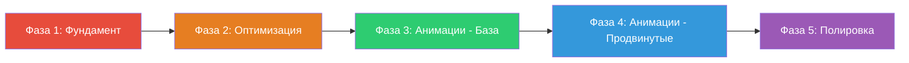
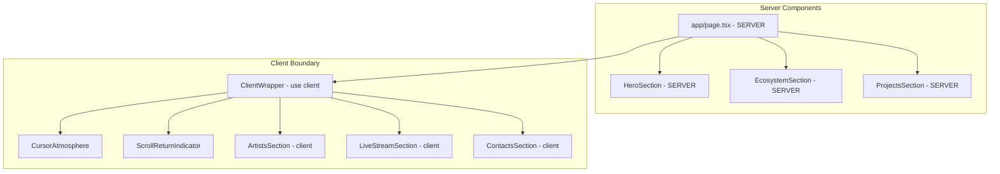

# RAAM Site — Оптимизация и анимации: Детальный план

**Дата:** 2026-05-10  
**Статус:** На рассмотрении

---

## Анализ текущего состояния

### Стек проекта
- **Next.js 16** (App Router) + **React 19** + **TypeScript 6**
- **Tailwind CSS 4** + **Framer Motion 12**
- **jose** для JWT-авторизации, **lucide-react** для иконок
- Данные: JSON-файл `data/db.json` (подходит для MVP)

### Архитектурная схема

```mermaid
graph TB
    subgraph Public Site
        P[app/page.tsx - use client]
        P --> H[HeroSection]
        P --> E[EcosystemSection]
        P --> A[ArtistsSection - client fetch]
        P --> L[LiveStreamSection - client fetch]
        P --> Pr[ProjectsSection]
        P --> C[ContactsSection]
    end

    subgraph Shared Components
        MR[MotionReveal - fade+blur]
        CA[CursorAtmosphere - CSS vars]
        SRI[ScrollReturnIndicator]
        AM[ArtistModal - AnimatePresence]
        HDR[Header - scroll show/hide]
        FB[FluidButton - CSS only]
        SF[SectionFrame - bg+header]
    end

    subgraph Admin Panel
        AL[admin/layout.tsx - auth gate]
        AD[admin/page.tsx - dashboard]
        AA[admin/artists - CRUD]
        AS[admin/stream - controls]
    end

    subgraph API Routes
        API1[/api/artists - GET/POST]
        API2[/api/artists/id - GET/PUT/DELETE]
        API3[/api/stream - GET/PUT]
        API4[/api/stream/status - YouTube check]
        API5[/api/auth - POST/DELETE]
        API6[/api/upload - POST]
    end

    A --> API1
    L --> API3
    L --> API4
    AA --> API1
    AA --> API2
    AA --> API6
    AS --> API3

    P --> MR
    P --> CA
    P --> SRI
    A --> AM
    P --> HDR
    C --> FB
    L --> SF
    Pr --> SF
    C --> SF
```

---

## Обнаруженные проблемы

### Критические

| # | Проблема | Файл | Влияние |
|---|----------|------|---------|
| 1 | Хардкод секрет JWT: `raam-admin-secret-2026` | [`lib/auth.ts`](lib/auth.ts:4) | Безопасность |
| 2 | Весь `page.tsx` — `"use client"`, нет Server Components | [`app/page.tsx`](app/page.tsx:1) | Производительность, SEO |
| 3 | Секции Artists/Stream возвращают `null` при загрузке — нет скелетонов | [`sections/ArtistsSection.tsx`](sections/ArtistsSection.tsx:25), [`sections/LiveStreamSection.tsx`](sections/LiveStreamSection.tsx:31) | UX |
| 4 | Дублирование данных: артисты в `site.ts` и `db.json` | [`data/site.ts`](data/site.ts:53), [`data/db.json`](data/db.json:1) | Поддерживаемость |

### Средние

| # | Проблема | Файл | Влияние |
|---|----------|------|---------|
| 5 | Пустой `next.config.ts` — нет оптимизации изображений, заголовков | [`next.config.ts`](next.config.ts:1) | Производительность |
| 6 | `ArtistForm.tsx` — 449 строк, монолит | [`components/ArtistForm.tsx`](components/ArtistForm.tsx:1) | Поддерживаемость |
| 7 | Нет `tailwind-merge` в утилите `cn()` — только `clsx` | [`lib/utils.ts`](lib/utils.ts:1) | Корректность классов |
| 8 | Изображения в корне проекта вместо `public/` | Корень: `artists.png`, `contact.png` и др. | Организация |
| 9 | Нет `loading.tsx` для admin-роутов | `app/admin/` | UX |
| 10 | `tsconfig.json`: `"jsx": "react-jsx"` вместо `"preserve"` для Next.js | [`tsconfig.json`](tsconfig.json:14) | Совместимость |

### Мелкие

| # | Проблема | Файл | Влияние |
|---|----------|------|---------|
| 11 | Нет Error Boundary | Весь проект | Отказоустойчивость |
| 12 | Нет `<Suspense>` границ | Весь проект | UX при загрузке |
| 13 | `CountdownTimer` — нет анимации смены цифр | [`components/CountdownTimer.tsx`](components/CountdownTimer.tsx:30) | Визуал |
| 14 | `FluidButton` — только CSS-переходы, без framer-motion | [`components/FluidButton.tsx`](components/FluidButton.tsx:1) | Визуал |

---

## Размеры файлов — анализ

| Файл | Строк | Оценка | Рекомендация |
|------|-------|--------|--------------|
| `components/ArtistForm.tsx` | 449 | 🔴 Крупный | Разбить на подкомпоненты |
| `data/site.ts` | 325 | 🟡 Крупный | Данные уже в db.json, оставить только статичные |
| `components/ArtistModal.tsx` | 239 | 🟡 Норма | Можно вынести подкомпоненты соц. ссылок |
| `data/db.json` | 287 | 🟡 Растёт | Нормально для JSON-БД |
| `sections/ContactsSection.tsx` | 205 | 🟡 Норма | — |
| `sections/ArtistsSection.tsx` | 101 | 🟢 Хорошо | — |
| `sections/LiveStreamSection.tsx` | 105 | 🟢 Хорошо | — |
| `sections/HeroSection.tsx` | 48 | 🟢 Отлично | — |
| `sections/EcosystemSection.tsx` | 54 | 🟢 Отлично | — |
| `sections/ProjectsSection.tsx` | 66 | 🟢 Отлично | — |
| `components/Header.tsx` | 149 | 🟢 Хорошо | — |
| `components/MotionReveal.tsx` | 28 | 🟢 Отлично | — |

---

## План улучшений — Фазированный подход

### Принцип последовательности

Каждая фаза завершается полностью перед началом следующей. Внутри фазы — шаги выполняются последовательно. Это гарантирует, что каждая следующая фаза строится на стабильном фундаменте.



---

## Фаза 1: Фундамент — Исправление критических проблем

> Без этого фундамента все остальные улучшения будут строиться на нестабильной базе.

### Шаг 1.1 — Настройка `next.config.ts`

**Зачем:** Пустой конфиг — нет оптимизации изображений, нет security-заголовков, нет настройки кеширования.

**Действия:**
- Добавить `images.remotePatterns` если нужны внешние изображения
- Добавить `headers()` для security-заголовков (CSP, X-Frame-Options)
- Включить `compress: true`
- Настроить `poweredByHeader: false`

**Файл:** [`next.config.ts`](next.config.ts:1)

### Шаг 1.2 — Безопасность авторизации

**Зачем:** Хардкод секрет — любой с доступом к коду может подделать JWT.

**Действия:**
- Удалить fallback-значение из `lib/auth.ts`
- Добавить проверку `process.env.ADMIN_PASSWORD` при старте
- Создать `.env.example` с перечнем нужных переменных
- Добавить `.env.local` в `.gitignore` (если нет)

**Файлы:** [`lib/auth.ts`](lib/auth.ts:4), `.env.example`, `.gitignore`

### Шаг 1.3 — Исправление `tsconfig.json`

**Зачем:** Next.js требует `"jsx": "preserve"` для корректной компиляции.

**Действия:**
- Заменить `"jsx": "react-jsx"` на `"jsx": "preserve"`

**Файл:** [`tsconfig.json`](tsconfig.json:14)

### Шаг 1.4 — Добавить `tailwind-merge` в `cn()`

**Зачем:** Без `tailwind-merge` конфликтующие классы (например `p-4 p-6`) не разрешаются корректно — `clsx` просто объединяет строки.

**Действия:**
- Установить `tailwind-merge`
- Обновить `cn()` в `lib/utils.ts`

**Файл:** [`lib/utils.ts`](lib/utils.ts:1)

### Шаг 1.5 — Переместить изображения из корня в `public/`

**Зачем:** Файлы `artists.png`, `contact.png`, `logo.png` и др. в корне проекта — это публичные изображения, они должны быть в `public/assets/images/` (где их копии уже есть).

**Действия:**
- Удалить дубликаты изображений из корня проекта
- Убедиться что все ссылки указывают на `/assets/images/...`

**Файлы:** Корень проекта → удалить `artists.png`, `contact.png`, `errhero.png`, `lilbl.png`, `logo.png`, `logoheader.png`, `projects.png`, `streams.png`

---

## Фаза 2: Оптимизация архитектуры

> Улучшение структуры кода, производительности и UX до добавления анимаций.

### Шаг 2.1 — Server Components для статичных секций

**Зачем:** Сейчас весь `page.tsx` — клиентский компонент из-за `CursorAtmosphere` и `activeArtist` state. Но Hero, Ecosystem, Projects — полностью статичные.

**Действия:**
- Вынести `CursorAtmosphere`, `ScrollReturnIndicator` и `activeArtist` state в отдельный клиентский wrapper
- Сделать `HeroSection`, `EcosystemSection`, `ProjectsSection` серверными компонентами
- `ArtistsSection` и `LiveStreamSection` остаются клиентскими (fetch данных)

**Архитектура после изменений:**



**Файлы:** [`app/page.tsx`](app/page.tsx:1), новый `components/ClientWrapper.tsx`

### Шаг 2.2 — Скелетоны загрузки для клиентских секций

**Зачем:** При загрузке данных секции возвращают `null` — контент «прыгает».

**Действия:**
- Создать `components/SectionSkeleton.tsx` — универсальный скелетон секции
- Заменить `return null` в `ArtistsSection` и `LiveStreamSection` на скелетон
- Добавить shimmer-анимацию в `globals.css`

**Файлы:** Новый `components/SectionSkeleton.tsx`, [`sections/ArtistsSection.tsx`](sections/ArtistsSection.tsx:25), [`sections/LiveStreamSection.tsx`](sections/LiveStreamSection.tsx:31), [`app/globals.css`](app/globals.css:1)

### Шаг 2.3 — `loading.tsx` для admin-роутов

**Зачем:** При навигации в админке — белый экран без индикации загрузки.

**Действия:**
- Создать `app/admin/loading.tsx` с spinner/skeleton
- Создать `app/admin/artists/loading.tsx`
- Создать `app/admin/stream/loading.tsx`

**Файлы:** Новые `loading.tsx` файлы

### Шаг 2.4 — Error Boundary

**Зачем:** Ошибка в одной секции рушит весь сайт.

**Действия:**
- Создать `components/ErrorBoundary.tsx` (или `error.tsx` для Next.js)
- Добавить `app/error.tsx` — глобальный error boundary
- Добавить `app/admin/error.tsx`

**Файлы:** Новые `error.tsx` файлы

### Шаг 2.5 — Разделение `ArtistForm.tsx`

**Зачем:** 449 строк в одном компоненте — сложно читать и поддерживать.

**Действия:**
- Вынести `BannerUpload` в `components/artist-form/BannerUpload.tsx`
- Вынести `GenreEditor` в `components/artist-form/GenreEditor.tsx`
- Вынести `PortfolioEditor` в `components/artist-form/PortfolioEditor.tsx`
- Вынести `SocialsEditor` в `components/artist-form/SocialsEditor.tsx`
- Основной `ArtistForm.tsx` — только компоновка + сабмит

**Файлы:** [`components/ArtistForm.tsx`](components/ArtistForm.tsx:1), новые файлы в `components/artist-form/`

### Шаг 2.6 — Устранение дублирования данных

**Зачем:** Артисты определены и в `site.ts`, и в `db.json`. При первом запуске `db.ts` читает из `site.ts`, но потом данные расходятся.

**Действия:**
- Удалить массив `artists` из `data/site.ts`
- Оставить только `siteConfig`, `capabilities`, `projects`, `contactLinks`
- Обновить `lib/db.ts` — при отсутствии `db.json` создавать из отдельного seed-файла
- Создать `data/seed.ts` с начальными данными артистов

**Файлы:** [`data/site.ts`](data/site.ts:53), [`lib/db.ts`](lib/db.ts:1), новый `data/seed.ts`

---

## Фаза 3: Анимации — Базовый слой

> Базовые анимации, которые улучшают восприятие сайта без сложной логики.

### Шаг 3.1 — Intro-анимация при загрузке страницы

**Зачем:** Сейчас контент появляется мгновенно — нет ощущения «премиальности». Для музыкального лейбла важна атмосфера.

**Действия:**
- Создать `components/PageIntro.tsx` — overlay с логотипом, который появляется и растворяется
- Логотип увеличивается из центра → контент появляется каскадом
- Использовать `AnimatePresence` + `motion`
- После завершения — overlay удаляется из DOM
- Учитывать `prefers-reduced-motion`

**Визуальное описание:**
1. Чёрный экран с логотипом RAAM по центру
2. Логотип плавно увеличивается (scale 0.8 → 1.0) и появляется (opacity 0 → 1)
3. Через 1.2с — логотип начинает растворяться, фон уходит вверх
4. Контент Hero появляется с задержкой

**Файлы:** Новый `components/PageIntro.tsx`, [`app/page.tsx`](app/page.tsx:1)

### Шаг 3.2 — Улучшение `MotionReveal` — варианты направлений

**Зачем:** Сейчас все элементы появляются одинаково (снизу + blur). Однообразие снижает эффект.

**Действия:**
- Добавить prop `direction` в `MotionReveal`: `"up" | "down" | "left" | "right" | "none"`
- Добавить prop `distance` для контроля дистанции
- Обновить существующие использования для разнообразия:
  - Ecosystem карточки: `direction="left"` для левой колонки, `"right"` для правой
  - Contacts: форма слева, контакты справа
  - Projects: `direction="up"` с разным `delay`

**Файлы:** [`components/MotionReveal.tsx`](components/MotionReveal.tsx:1), все секции

### Шаг 3.3 — Parallax-эффект для Hero

**Зачем:** Фон Hero статичен (только CSS zoom-анимация). Parallax добавляет глубину.

**Действия:**
- Использовать `useScroll` + `useTransform` из framer-motion
- Фон-изображение двигается медленнее при скролле (0.3x скорости)
- Текстовый контент — нормальная скорость
- Ограничить parallax диапазоном 0-1 высоты экрана

**Файлы:** [`sections/HeroSection.tsx`](sections/HeroSection.tsx:1)

### Шаг 3.4 — Gradient-переходы между секциями

**Зачем:** Сейчас секции разделены резкими границами. Плавные переходы создают ощущение единого полотна.

**Действия:**
- Добавить `before:`/`after:` pseudo-elements с градиентами в `SectionFrame`
- Или создать отдельный `components/SectionTransition.tsx`
- Градиент: от прозрачного к `#080706` и обратно
- Высота перехода: ~80-120px

**Файлы:** [`components/SectionFrame.tsx`](components/SectionFrame.tsx:1) или новый `components/SectionTransition.tsx`

### Шаг 3.5 — Анимация цифр в `CountdownTimer`

**Зачем:** Цифры обновляются мгновенно — нет визуальной обратной связи.

**Действия:**
- Создать `components/AnimatedDigit.tsx` — одна цифра с flip-анимацией
- При изменении значения — старая цифра уходит вверх, новая приходит снизу
- Использовать `AnimatePresence` + `motion.span`
- Стиль: как механический счётчик/табло

**Файлы:** Новый `components/AnimatedDigit.tsx`, [`components/CountdownTimer.tsx`](components/CountdownTimer.tsx:30)

### Шаг 3.6 — Улучшение `FluidButton` с framer-motion

**Зачем:** Сейчас только CSS-переходы. Framer-motion даст более плавные и управляемые анимации.

**Действия:**
- Добавить `whileHover` и `whileTap` в `FluidButton`
- `whileHover`: лёгкое увеличение (scale 1.02) + усиление свечения
- `whileTap`: уменьшение (scale 0.97)
- Сохранить CSS-эффект свечения как базу, framer-motion для трансформаций

**Файлы:** [`components/FluidButton.tsx`](components/FluidButton.tsx:1)

---

## Фаза 4: Анимации — Продвинутый слой

> Сложные анимации, которые требуют дополнительной логики и тестирования.

### Шаг 4.1 — Cursor trail-эффект

**Зачем:** Сейчас `CursorAtmosphere` только двигает CSS-переменную для radial-gradient. Trail-эффект добавит «живость» курсору.

**Действия:**
- Расширить `CursorAtmosphere` или создать `components/CursorTrail.tsx`
- Отслеживать последние N позиций курсора
- Рисовать тонкий trail из затухающих точек через SVG или canvas
- Trail появляется с задержкой и плавно затухает
- Отключать на мобильных (нет курсора)
- Учитывать `prefers-reduced-motion`

**Файлы:** [`components/CursorAtmosphere.tsx`](components/CursorAtmosphere.tsx:1) или новый `components/CursorTrail.tsx`

### Шаг 4.2 — Staggered reveal для Ecosystem-карточек

**Зачем:** Сейчас карточки появляются через `MotionReveal` с `delay={index * 0.06}`. Можно сделать эффектнее.

**Действия:**
- Использовать `motion.div` с `variants` и `staggerChildren`
- Каждая карточка появляется с лёгким поворотом (rotateY: 8 → 0)
- Добавить hover-эффект: лёгкий наклон в сторону курсора (3D tilt)
- Использовать `onMouseMove` для расчёта угла наклона

**Файлы:** [`sections/EcosystemSection.tsx`](sections/EcosystemSection.tsx:31)

### Шаг 4.3 — Улучшение hover-эффекта артистов

**Зачем:** Сейчас при hover имя увеличивается, но остальные имена не реагируют. Нет ощущения «фокуса».

**Действия:**
- При hover на артиста — остальные имена слегка уменьшаются и тускнеют (opacity 0.3)
- Использовать CSS `group` + `group-hover` или framer-motion state
- Hover-имя увеличивается от центра с `transform-origin: center`
- Подпись с жанрами появляется с задержкой 150ms

**Файлы:** [`sections/ArtistsSection.tsx`](sections/ArtistsSection.tsx:51)

### Шаг 4.4 — Fan-reveal для Projects-карточек

**Зачем:** Карточки проектов появляются стандартно. Fan-эффект подчеркнёт структуру 5 колонок.

**Действия:**
- Карточки появляются слева направо с задержкой
- Каждая начинается с `rotateY: -15, opacity: 0` → `rotateY: 0, opacity: 1`
- Эффект «раскрытия веера»
- На мобильных — простой stagger сверху вниз

**Файлы:** [`sections/ProjectsSection.tsx`](sections/ProjectsSection.tsx:16)

### Шаг 4.5 — Contacts: встречное появление

**Зачем:** Форма и контакты появляются одновременно. Встречное движение создаст динамику.

**Действия:**
- Форма (левая колонка): появляется слева (`x: -60 → 0`)
- Контакты (правая колонка): появляется справа (`x: 60 → 0`)
- Использовать `MotionReveal` с `direction="left"` и `direction="right"`

**Файлы:** [`sections/ContactsSection.tsx`](sections/ContactsSection.tsx:66)

### Шаг 4.6 — Scroll-triggered background shift

**Зачем:** Фон сайта однотонный. Тонкие изменения цвета при скролле добавляют глубину.

**Действия:**
- Отслеживать scroll position через `useScroll`
- Мягко менять `--background` CSS-переменную от `#080706` к `#0a0908` к `#070605`
- Или менять opacity градиентных overlay на секциях
- Очень тонкий эффект — почти незаметный, но ощущаемый

**Файлы:** Новый `components/ScrollBackground.tsx` или расширение [`components/CursorAtmosphere.tsx`](components/CursorAtmosphere.tsx:1)

---

## Фаза 5: Полировка

> Финальные штрихи, которые делают сайт «готовым».

### Шаг 5.1 — Shimmer-эффект для скелетонов

**Действия:**
- Добавить CSS-анимацию shimmer (движущийся градиент) для скелетонов загрузки
- Использовать `@keyframes shimmer` в `globals.css`

**Файлы:** [`app/globals.css`](app/globals.css:1), `components/SectionSkeleton.tsx`

### Шаг 5.2 — Smooth scroll для навигации

**Действия:**
- Проверить что `scroll-behavior: smooth` работает корректно
- Добавить `scroll-margin-top` для секций (уже есть `scroll-mt-24`)
- При клике на навигацию — плавная прокрутка с offset для header

**Файлы:** [`components/Header.tsx`](components/Header.tsx:1)

### Шаг 5.3 — Оптимизация изображений

**Действия:**
- Конвертировать PNG в WebP для `public/assets/images/`
- Добавить `sizes` prop для всех `next/image` (частично есть)
- Проверить что `priority` стоит только на Hero-изображениях

**Файлы:** Все секции с `Image`

### Шаг 5.4 — Тестирование `prefers-reduced-motion`

**Действия:**
- Проверить что все framer-motion анимации уважают `prefers-reduced-motion`
- Добавить `useReducedMotion()` hook для framer-motion
- Убедиться что CSS `@media (prefers-reduced-motion: reduce)` покрывает все анимации

**Файлы:** Все компоненты с анимациями

### Шаг 5.5 — Lighthouse аудит

**Действия:**
- Запустить Lighthouse для Performance, Accessibility, Best Practices, SEO
- Исправить найденные проблемы
- Цель: 90+ по всем метрикам

---

## Сводная таблица шагов

| Фаза | Шаг | Приоритет | Сложность | Зависимости |
|------|-----|-----------|-----------|-------------|
| 1 | 1.1 next.config.ts | 🔴 Высокий | Низкая | Нет |
| 1 | 1.2 Безопасность auth | 🔴 Высокий | Низкая | Нет |
| 1 | 1.3 tsconfig.json | 🟡 Средний | Низкая | Нет |
| 1 | 1.4 tailwind-merge | 🟡 Средний | Низкая | Нет |
| 1 | 1.5 Перемещение изображений | 🟢 Низкий | Низкая | Нет |
| 2 | 2.1 Server Components | 🔴 Высокий | Средняя | 1.1 |
| 2 | 2.2 Скелетоны загрузки | 🟡 Средний | Средняя | 2.1 |
| 2 | 2.3 loading.tsx для admin | 🟡 Средний | Низкая | Нет |
| 2 | 2.4 Error Boundary | 🟡 Средний | Низкая | Нет |
| 2 | 2.5 Разделение ArtistForm | 🟢 Низкий | Средняя | Нет |
| 2 | 2.6 Устранение дублирования | 🟡 Средний | Средняя | 2.1 |
| 3 | 3.1 Intro-анимация | 🟡 Средний | Средняя | 2.1 |
| 3 | 3.2 MotionReveal направления | 🟡 Средний | Низкая | Нет |
| 3 | 3.3 Hero parallax | 🟡 Средний | Средняя | 2.1 |
| 3 | 3.4 Gradient-переходы | 🟡 Средний | Низкая | Нет |
| 3 | 3.5 CountdownTimer анимация | 🟢 Низкий | Средняя | Нет |
| 3 | 3.6 FluidButton framer-motion | 🟢 Низкий | Низкая | Нет |
| 4 | 4.1 Cursor trail | 🟢 Низкий | Высокая | 3.2 |
| 4 | 4.2 Ecosystem stagger | 🟢 Низкий | Средняя | 3.2 |
| 4 | 4.3 Artists hover улучшение | 🟡 Средний | Средняя | 3.2 |
| 4 | 4.4 Projects fan-reveal | 🟢 Низкий | Средняя | 3.2 |
| 4 | 4.5 Contacts встречное | 🟢 Низкий | Низкая | 3.2 |
| 4 | 4.6 Background shift | 🟢 Низкий | Средняя | 3.3 |
| 5 | 5.1 Shimmer для скелетонов | 🟢 Низкий | Низкая | 2.2 |
| 5 | 5.2 Smooth scroll | 🟢 Низкий | Низкая | Нет |
| 5 | 5.3 Оптимизация изображений | 🟡 Средний | Низкая | Нет |
| 5 | 5.4 prefers-reduced-motion | 🟡 Средний | Низкая | Все анимации |
| 5 | 5.5 Lighthouse аудит | 🟡 Средний | Низкая | Все |

---

## Рекомендуемый порядок реализации

Шаги внутри каждой фазы можно выполнять параллельно, но фазы — последовательно:

1. **Фаза 1** (все шаги параллельно) → стабильный фундамент
2. **Фаза 2** (2.1 → 2.2 → 2.6 последовательно, остальные параллельно) → оптимизированная архитектура
3. **Фаза 3** (3.2 сначала, затем остальные параллельно) → базовые анимации
4. **Фаза 4** (все параллельно) → продвинутые анимации
5. **Фаза 5** (5.4 и 5.5 в конце) → полировка

---

## Новые файлы, которые будут созданы

| Файл | Фаза | Назначение |
|------|------|------------|
| `.env.example` | 1 | Шаблон переменных окружения |
| `components/SectionSkeleton.tsx` | 2 | Скелетон загрузки секций |
| `app/admin/loading.tsx` | 2 | Загрузка admin |
| `app/admin/artists/loading.tsx` | 2 | Загрузка artists admin |
| `app/admin/stream/loading.tsx` | 2 | Загрузка stream admin |
| `app/error.tsx` | 2 | Глобальный error boundary |
| `app/admin/error.tsx` | 2 | Admin error boundary |
| `components/artist-form/BannerUpload.tsx` | 2 | Подкомпонент формы |
| `components/artist-form/GenreEditor.tsx` | 2 | Подкомпонент формы |
| `components/artist-form/PortfolioEditor.tsx` | 2 | Подкомпонент формы |
| `components/artist-form/SocialsEditor.tsx` | 2 | Подкомпонент формы |
| `data/seed.ts` | 2 | Начальные данные для БД |
| `components/PageIntro.tsx` | 3 | Intro-анимация |
| `components/AnimatedDigit.tsx` | 3 | Анимация цифр |
| `components/CursorTrail.tsx` | 4 | Trail-эффект курсора |
| `components/ScrollBackground.tsx` | 4 | Scroll-based background |
