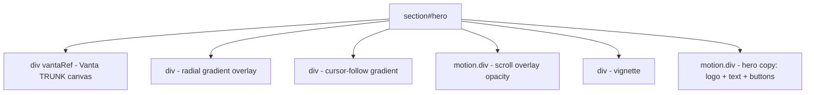

# UI Fixes — Batch 3 (Updated)

## Правка 1: Flyout триггер — увеличить иконку письма

**Файл:** `sections/ContactsSection.tsx`

Увеличить **иконку-триггер** (круглый логотип с `<Mail>`) от которого вылетает flyout-панель Direct Channel. Кнопки внутри flyout остаются как есть — шире их делать не надо.

- `h-10 w-10` → `h-12 w-12` (или `h-14 w-14`)
- Иконку `<Mail size={16}>` → `<Mail size={20}>` (или `size={22}`)
- Это даёт более крупную зону ховера и визуально выделяет триггер

---

## Правка 2: Flyout Direct Channel — уменьшить размер

**Файл:** `sections/ContactsSection.tsx`

Уменьшить flyout-панель Direct Channel в десктопе:
- Ширина: `w-[24rem]` → `w-[20rem]`
- Уменьшить padding внутри
- Уменьшить иконки

---

## Правка 3: Artists — центровать от центра, раскидать влево-вправо, больше отступ сверху

**Файл:** `sections/ArtistsSection.tsx`

Изменить `CHAOTIC_POSITIONS` так чтобы имена расходились от центра влево и вправо, а не прижимались к краям. Увеличить отступ сверху:
- Добавить `pt-16 sm:pt-20` к контейнеру
- Первый `top` сдвинуть с 6% → ~14%
- Позиции `x` сделать симметричными от центра: например 20%/80%, 30%/70%, 40%/60%

---

## Правка 4: Artists мобильный — увеличить шрифт имён

**Файл:** `sections/ArtistsSection.tsx`

Увеличить размер шрифта имён артистов в мобильной версии:
- `text-xl` → `text-2xl` для мобильного

---

## Правка 5: Projects — вставить фоновые изображения из bckgr/

**Затрагиваемые файлы:**
- `types/content.ts` — добавить поле `bgImage?: string` в интерфейс `Project`
- `data/site.ts` — добавить `bgImage` к каждому проекту
- `sections/ProjectsSection.tsx` — использовать `bgImage` как фон карточки
- Копировать файлы из `bckgr/` в `public/assets/images/projects/`

**Маппинг изображений:**
| Файл | Проект |
|------|--------|
| `cassette.png` | Cassette Series |
| `coach.png` | Coaching |
| `raamfomo.png` | FOMO |
| `uptempo.png` | UpTempo |

**Реализация в ProjectsSection:**
- Добавить `background-image` через `style={{ backgroundImage: ... }}` или Next.js `Image` с `fill` + `object-cover` + opacity overlay
- Текст поверх изображения с затемнением (`bg-gradient-to-t from-black/80`)

---

## ~~Правка 6: Projects — добавить Play кнопку~~ — ОТМЕНЕНО

Кнопку Play на карточки Projects добавлять **не нужно**. VideoModal и YouTube-ссылки также не нужны. `next.config.ts` не меняем.

---

## Правка 7 (НОВАЯ): Hero — заменить фон на Vanta.js TRUNK

**Затрагиваемые файлы:**
- `sections/HeroSection.tsx` — заменить статичный Image фон на Vanta.js TRUNK WebGL-эффект
- `package.json` — добавить зависимости `vanta` и `three`
- `app/globals.css` — убрать `@keyframes slow-zoom` и `--animate-slow-zoom` (больше не нужны)
- Удалить `public/assets/images/dj-turntable-hero.jpg` (старый фон больше не нужен)
- `data/site.ts` — убрать `heroImage` из `siteConfig` (или оставить для OG-мета, но не рендерить)

**Параметры Vanta TRUNK:**
```
VANTA.TRUNK({
  el: "#hero-background",
  mouseControls: true,
  touchControls: true,
  gyroControls: false,
  minHeight: 200.00,
  minWidth: 200.00,
  scale: 1.00,
  scaleMobile: 1.00,
  color: 0xbbb4b5,
  backgroundColor: 0x0,
  chaos: 3.50
})
```

**Реализация — React-обёртка для Vanta.js:**

Vanta.js — это императивная библиотека, работающая через `script` теги и глобальные объекты. В Next.js (React) нужна обёртка:

1. Установить npm-пакеты:
   - `three` (peer dependency для vanta)
   - `vanta` (содержит все эффекты включая TRUNK)

2. Создать хук `useVantaTrunk` или встроить логику прямо в `HeroSection`:
   - Импорт только на клиенте: `useEffect` + динамический `import('vanta/dist/vanta.trunk.min')`
   - `import * as THREE from 'three'` — сделать глобальным: `window.THREE = THREE` (Vanta ищет THREE в глобальной области)
   - В `useEffect` создать эффект: `VANTA.TRUNK({ el: containerRef.current, ... })`
   - Вернуть cleanup: `effect.destroy()` при размонтировании
   - Проверка `prefers-reduced-motion`: если да — не инициализировать Vanta, показать статичный чёрный фон

3. Структура HeroSection после изменений:
   ```
   <section id="hero">
     <div ref={vantaRef} className="absolute inset-0" />  ← Vanta canvas
     <div className="absolute inset-0 bg-[radial-gradient(...)]" />  ← overlay градиенты
     <div className="absolute inset-0 vignette" />  ← виньетка
     <motion.div className="hero-copy ...">  ← контент (лого, текст, кнопки)
   </section>
   ```

4. Удалить из HeroSection:
   - `<Image src={siteConfig.heroImage} ...>` — статичный фон
   - `<motion.div style={{ y: imageY }}>` — параллакс изображения (не нужен, Vanta сам анимируется)
   - `imageY` transform — убрать
   - Ссылку на `siteConfig.heroImage`

5. Оставить в HeroSection:
   - Все overlay-градиенты (они поверх Vanta canvas)
   - Виньетку
   - Параллакс текста (`textY`, `contentScale`, `contentOpacity`, `contentFilter`)
   - `overlayOpacity` — можно оставить для затемнения при скролле

6. Удалить `public/assets/images/dj-turntable-hero.jpg`

7. В `app/globals.css`:
   - Удалить `--animate-slow-zoom` из `@theme inline`
   - Удалить `@keyframes slow-zoom`

8. В `data/site.ts`:
   - Убрать `heroImage` из `siteConfig` (или закомментировать с пометкой что больше не используется для рендера, но может понадобиться для OG image)

**Важно:** Vanta.js TRUNK — это WebGL-эффект с 3D-линиями, реагирующий на мышь. Он создаёт `<canvas>` внутри целевого элемента. Градиенты и виньетка должны быть слоями **поверх** canvas с `pointer-events: none`.

**Схема слоёв Hero:**


