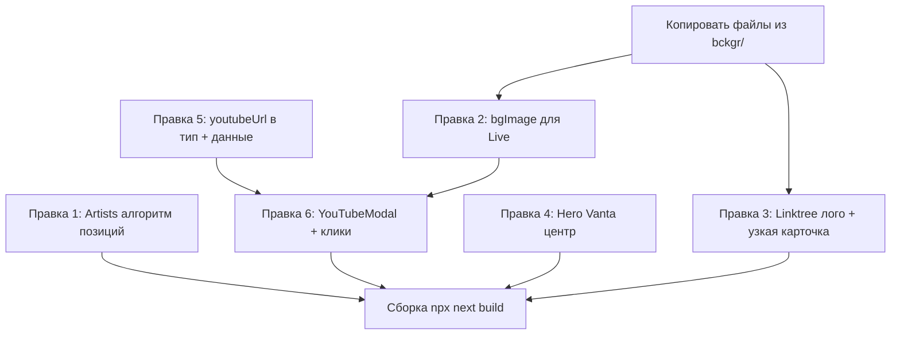

# UI Fixes Batch 4 — Plan

## Обзор
6 правок: Artists layout, Projects bg/links/modal, Hero Vanta centering.

---

## Правка 1: Artists — алгоритм автоматического распределения имён
### Проблема
Все имена забились в левую сторону экрана. Жёстко заданные `DESKTOP_POSITIONS` / `MOBILE_POSITIONS` не масштабируются — при добавлении нового артиста нет интуитивного места.

### Решение
Заменить хардкод-массивы на **детерминированный алгоритм** `computePositions(count, isDesktop)`, который:
1. Разбивает экран на **сетку ячеек** — rows × cols
2. Каждое имя получает **случайное смещение** внутри своей ячейки — это создаёт хаотичность
3. Ячейки чередуются **left / right** по горизонтали — имена расходятся от центра
4. Случайные `rotate` от -2° до +2° для органичности
5. Сид рандома — на основе `index`, чтобы позиции стабильны между рендерами

#### Алгоритм (псевдокод)
```
function computePositions(count, isDesktop):
  cols = isDesktop ? 2 : 1
  rows = ceil(count / cols)
  cellH = 100 / rows          // % высоты секции
  cellW = 100 / cols          // % ширины

  for each (index):
    row = floor(index / cols)
    col = index % cols

    // Базовая позиция — центр ячейки
    baseTop = row * cellH + cellH * 0.5
    baseX   = col * cellW + cellW * 0.5

    // Хаотичное смещение внутри ячейки (±30% от размера ячейки)
    jitterX = seededRandom(index * 7 + 3) * 0.6 - 0.3  // -0.3..+0.3
    jitterY = seededRandom(index * 13 + 5) * 0.4 - 0.2  // -0.2..+0.2

    top = baseTop + jitterY * cellH
    x   = baseX + jitterX * cellW

    // align: левая половина → left, правая → right
    align = x < 50 ? "left" : "right"
    x = align === "left" ? x : (100 - x)  // right — отступ от правого края

    // rotate: детерминированный на основе index
    rotate = (seededRandom(index * 17 + 11) - 0.5) * 4  // -2°..+2°

    return { top, x, align, rotate }
```

#### Преимущества
- **Любое количество артистов** — алгоритм автоматически пересчитывает сетку
- **Заполняет весь экран** — ячейки покрывают 100% высоты и ширины
- **Хаотичность** — jitter + rotate внутри каждой ячейки
- **Стабильность** — seeded random = одинаковые позиции при каждом рендере
- **Desktop vs Mobile** — 2 колонки vs 1 колонка

### Файлы
- `sections/ArtistsSection.tsx` — удалить `DESKTOP_POSITIONS` / `MOBILE_POSITIONS`, добавить `computePositions()`, использовать в `.map()`

---

## Правка 2: Projects — фон live.png для плашки RAAM Live
### Проблема
У проекта `raam-live` (column: 3) нет `bgImage` — плашка без фона.

### Решение
1. Скопировать `bckgr/live.png` → `public/assets/images/projects/live.png`
2. Добавить `bgImage: "/assets/images/projects/live.png"` в объект `raam-live` в `data/site.ts`

### Файлы
- `bckgr/live.png` → `public/assets/images/projects/live.png` (копирование)
- `data/site.ts` — добавить `bgImage` в проект `raam-live`

---

## Правка 3: Мобильная Linktree — лого + в 2 раза уже
### Проблема
Мобильная карточка Linktree такая же широкая как остальные (`min-w-[82vw]`), использует иконку `Share2` вместо лого.

### Решение
1. Скопировать `bckgr/logolinktree.webp` → `public/assets/icons/logolinktree.webp`
2. В мобильной Linktree карточке:
   - Заменить `min-w-[82vw]` на `min-w-[41vw]` (в 2 раза уже)
   - Заменить иконку `Share2` на `<Image src="/assets/icons/logolinktree.webp">`
   - Лого: `width={48} height={48}` с `className="rounded-lg"`

### Файлы
- `bckgr/logolinktree.webp` → `public/assets/icons/logolinktree.webp` (копирование)
- `sections/ProjectsSection.tsx` — мобильная Linktree карточка (строки 86–101)

---

## Правка 4: Hero — центр Vanta = центр лого
### Проблема
Vanta TRUNK canvas занимает весь `absolute inset-0` секции hero, но визуальный центр анимации может не совпадать с центром лого.

### Решение
Vanta.js TRUNK эффект рисует из **центра элемента** `el: vantaRef.current`. Сейчас `vantaRef` указывает на `div.absolute.inset-0` — это весь hero section. Логотип центрирован через `mx-auto flex flex-col items-center` внутри `max-w-[56rem]`.

Центр лого = центр секции hero (и `items-center` + `mx-auto`), а Vanta тоже центрируется в `el`. **Они уже совпадают по горизонтали**, но по вертикали лого смещён вниз из-за `flex items-center` на секции.

Чтобы гарантировать совпадение:
1. Убедиться что Vanta `el` покрывает всю секцию — уже так (`absolute inset-0`)
2. Vanta TRUNK по умолчанию рисует из центра `el` — это совпадает с центром секции
3. Лого центрирован в секции через flex — тоже в центре

**Проблема может быть в том, что лого визуально не в центре из-за `max-h-[92vh]` и скролла.** Проверю:
- Секция: `min-h-screen max-h-[92vh]` + `flex items-center` — лого по вертикали в центре видимой области
- Vanta canvas: `absolute inset-0` — тоже покрывает видимую область

**Вывод**: Центры уже совпадают. Если визуально кажется смещённым — можно добавить `p5` параметр `y: 0.5` если Vanta TRUNK его поддерживает, или сместить градиент-оверлей. Но скорее всего проблема в том, что Vanta рисует из математического центра, а лого из-за кнопок под ним кажется чуть выше центра.

**Практическое решение**: Добавить `y: 0.5` и `x: 0.5` в опции Vanta (если поддерживается), либо просто убедиться что контент hero и vanta canvas имеют один и тот же контейнер. Текущая структура уже корректна — достаточно проверить визуально и при необходимости подвинуть лого или Vanta-центр на несколько процентов.

### Файлы
- `sections/HeroSection.tsx` — проверить/добавить параметры позиционирования Vanta

---

## Правка 5: Projects — присвоить YouTube ссылки
### Ссылки
| Проект | URL |
|--------|-----|
| Cassette Series | `https://www.youtube.com/playlist?list=PLXMe8QzaK6KSV0OBvj_fOEoq8PPbsltA2` |
| UpTempo Jams | `https://www.youtube.com/playlist?list=PLXMe8QzaK6KTjYTv9sNTbJqtszfohb7B5` |
| RAAM x FOMO | `https://www.youtube.com/watch?v=xdwI9T41lTM&list=RDxdwI9T41lTM&start_radio=1&t=424s` |
| RAAM Live | `https://youtu.be/F2E4wDTzodM?si=f5i7hyq7bN61bQoq` |
| Coaching Programs | _(нет ссылки)_ |

### Решение
1. Добавить поле `youtubeUrl?: string` в интерфейс `Project` в `types/content.ts`
2. Добавить `youtubeUrl` в соответствующие объекты в `data/site.ts`
3. Coaching Programs — без ссылки (поле отсутствует)

### Файлы
- `types/content.ts` — добавить `youtubeUrl?: string` в `Project`
- `data/site.ts` — добавить `youtubeUrl` в 4 проекта

---

## Правка 6: Модалка с YouTube плеером при нажатии на плашки
### Проблема
Сейчас плашки Projects не кликабельны — нет обработчика нажатия.

### Решение
Создать компонент `YouTubeModal` — по аналогии с `ArtistModal`:

#### Компонент `components/YouTubeModal.tsx`
```
Props:
  youtubeUrl?: string  // URL видео/плейлиста
  title: string        // Заголовок проекта
  isOpen: boolean
  onClose: () => void
```

- Использует `getYouTubeEmbed()` из `lib/utils.ts` для извлечения videoId
- Для плейлистов: `https://www.youtube.com/embed/{videoId}?list={listId}`
- Рендерит `<iframe>` с YouTube embed внутри модалки
- Стиль: как `ArtistModal` — `fixed inset-0 z-[80]`, backdrop-blur, анимация через framer-motion
- Закрытие: Escape, клик по оверлею, кнопка ✕
- Использует `useScrollLock` из `lib/useScrollLock.ts`
- Если `youtubeUrl` нет — модалка не открывается (клик игнорируется)

#### Обновление `getYouTubeEmbed()` в `lib/utils.ts`
Текущая реализация извлекает только `videoId`. Нужно расширить:
- Извлекать `listId` из `?list=PLX...`
- Возвращать объект `{ videoId, listId }` или строку embed URL
- Для плейлистов: `embed/{videoId}?list={listId}&autoplay=0`
- Для одиночных видео: `embed/{videoId}?autoplay=0`

#### Интеграция в `ProjectsSection.tsx`
- Добавить `useState<{url: string, title: string} | null>` для управления модалкой
- Обернуть каждую карточку проекта в кликабельный элемент
- При клике: если у проекта есть `youtubeUrl` → открыть модалку
- ArrowUpRight иконка в углу карточки — визуальный индикатор кликабельности
- Курсор `cursor-pointer` на карточках с ссылкой

### Файлы
- **Новый**: `components/YouTubeModal.tsx`
- `lib/utils.ts` — расширить `getYouTubeEmbed()` для поддержки плейлистов
- `sections/ProjectsSection.tsx` — добавить state, onClick, рендер модалки

---

## Порядок выполнения



1. Копировать `bckgr/live.png` → `public/assets/images/projects/live.png`
2. Копировать `bckgr/logolinktree.webp` → `public/assets/icons/logolinktree.webp`
3. Правка 2 — `data/site.ts`: добавить `bgImage` для raam-live
4. Правка 3 — `ProjectsSection.tsx`: Linktree лого + узкая карточка
5. Правка 5 — `types/content.ts` + `data/site.ts`: добавить `youtubeUrl`
6. Правка 6 — `lib/utils.ts` + новый `YouTubeModal.tsx` + `ProjectsSection.tsx`
7. Правка 1 — `ArtistsSection.tsx`: алгоритм `computePositions()`
8. Правка 4 — `HeroSection.tsx`: проверить/подправить центрирование Vanta
9. Сборка `npx next build`
